<h1 style="color:white; background-color:darkorange;"><center style="font-size:50px">Do you know what you are eating ?</center><br><center style="font-size:20px">Author: Marco Lin</center></h1>


### When the waitress asked if I wanted my pizza cut into four or eight slices, I said, ‘Four. I don’t think I can eat eight.

<h2><center style="font-size:30px"><u style="color: coral">Objective of the Proposed Research</u></center></h2>

A new all-you-can-eat buffet at the University of the Pacific hired us to create a recommendation engine for email coupon campaigns. Your engine will send targeted emails to students with coupons that are likely to encourage them to come. 
So, our dataset was from a questionnaire which has over 120 students. In dataset, we have 61 columns, for example GPA, Gender, income, parent education level. it also asked people to give a score how level you like Indian food or Tai food. 
In this report, at the first, we will explore some interesting answers. For example, what is the cuisine type most. We also try to analyze What misunderstanding of food people have. 
Then, after that we will focus on clustering with k-mean. After K-mean, we have prediction and then end with recommandation and summary.

<h2><center style="font-size:30px"><u style="color: coral">Data Exploration</u></center></h2>


```python
import pandas as pd
import numpy as np
from pandas import DataFrame, Series
import matplotlib.pyplot as plt
from matplotlib.colors import ListedColormap


%matplotlib inline
```


```python
FoodData = pd.read_csv("food-choices/food_coded.csv")
```

<p style="font-size:20px;"><u style="color: darkred">A. cuisine type</u></p>


```python
FoodData['cuisine'].value_counts().plot.bar()
```


    <matplotlib.axes._subplots.AxesSubplot at 0x11d37f438>


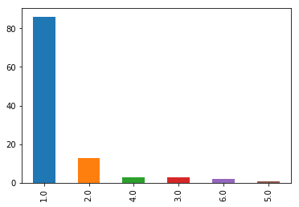


<p style="font-size:20px"><u style="color: steelblue">Explanation:</u></p>
It shows that over 80 students grew up with American food.

<p style="font-size:20px;"><u style="color: darkred">B. Score of different type of food</u></p>


```python
FoodData[['greek_food','indian_food','italian_food','thai_food']].apply(pd.value_counts).plot.bar()
```


    <matplotlib.axes._subplots.AxesSubplot at 0x11d3fafd0>


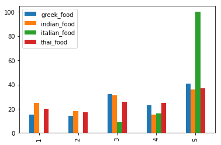


<p style="font-size:20px"><u style="color: steelblue">Explanation:</u></p>
It appears that most students gave Italian food 5 scores. We can say they really like italian food.

<p style="font-size:20px;"><u style="color: darkred">C. Word Association </u></p>

### breakfast

 
 

### coffee

 
 <img src="data:image/jpeg;base64,/9j/4AAQSkZJRgABAQAAAQABAAD/2wCEAAkGBxAQEBAQDxAPDxAPEA8QDw8PDxANDxAPFxEWFxURFRUYHSggGBolGxUVITEhJSkrLi4uFyAzODMtNygtLisBCgoKDg0OFxAQGC0dHx0tLSstMS0tLS0rLS0tLS0rLS0tLS0tListLS0tLSstLS0tLS0tLSstLS0tLS0rKystL//AABEIALcBEwMBIgACEQEDEQH/xAAcAAABBQEBAQAAAAAAAAAAAAADAAECBAUGBwj/xAA+EAABAwIDBQUGBQMCBwEAAAABAAIDBBEFITEGEkFRcRMiYYGRMlKhscHRBxRCYnIjgvBzkhYzVKLC0vEV/8QAGgEAAwEBAQEAAAAAAAAAAAAAAAECAwQFBv/EACkRAQEAAgEDAwMDBQAAAAAAAAABAhEDBCExEkFRImGBBRPwFJGhwdH/2gAMAwEAAhEDEQA/APNQblHDVSher8JuVmcE3UeFqdjLlXIIVUNYpY1pxRoFNGtGNi1kZ2mYxWI2pmNRQqSe6G56Z71XkegCOlVeSZBlmVWWdTaqRadOmFQst9QmZOs7k0mLZZKjtesuGRXYnXTlKxcYUVpQI0doVxFFapJmp1SUgpNKgFK6QEuouKa6YlALeTEqKZAPdMSkmsmDKJU0xQAnBDIRnBDIQAiFEhFITEIAVklLdSQHlUT81pUr1kMWnRrDS5W7SNutKnYsqlfZakEmSrE60IArTSqEciMJloixcD1F8qqGZDdMjY0svlVWWZCfMqssiVqpEpp1QlnUKiVUJJVnaqLTpUSJ6osK18GwmepduwROktq4ZMb/ACcch6qFwenetOnXSYT+H5ABqZgObIRe397v/VdBDgtBCP8Alhx5yPc+/le3wTlKuKiVloXY/wD6FHHk2KAdI2fZROP03FkfnG1V64n0OTAT2XVDEaCTWODyaGH1Cc4TRS+wXRn9r98ejlU5Im4Vylklu1mzUzRvRFszf291/wDtP0KxXMIJBBBGRBFiPJXLKmzSKScBS3UyDslZEsmKQQsmKkVEoBlEpymKYRKgVMqJQEEykUyAjZJOnQbyQNV2mKrWRolzrakMivQzLKiKtRSKoGwyVEMqzWTJfmFWw0HToRmVIy30zJyHHNblBsrXTAEQ7gOhlc2P4HP4ItGmaZUCSRdFPsNiDRcRMk8GSsv/AN1lgYhh08BtPFJEdBvtIaT4O0Pkp2elGUqruXKtOC9J2A2PDN2pnbeQ5xMcMo2+8R7x+ChWmdsh+HxkDZq0FrdWwA7riObzw6DPpovQHyw0zBHG1rWtFmsYA0DyCliNfuAsj83fZcLi+PtaS2K0juLj7AP1KnLOYzurHG5eG7XYu83z3Queq8YZxk3j+27ly+JYmTnLIT+3gOjQsiTEifZb5n7Bc95bfDox4Z7utlxYHQP87D6qu/EevqFyLq6Y6WHkD80hWzDiPNrbfJZ25/K5hj8OqGI/y8xcK1T4o9pu1xHQ2XIMxJ49pjT07pVuDE43ZG7T+7T1T9ec+4vHjXo+E7XPYQH94c9Cusjnpq5nftvcHtye3/ORXjcUxHiPX0K18MxJ0bgWuItwW2HMxz4XYYrhElObnvRn2ZBp0PIqgunwHGmVMZZIAbizmnNZOO4Wad1xnE/2Hcv2ldmGe3JljpmkqJKYuUSVaCJUSnUSmDFMU6YoBiolSTFARKiVMqJQEUk6SDeUhFjQWo4KwWtNTh6AJFHfVEt9uoGfNViVOFt3NB4kA9LpbN6NsNhrWhs8gBkdYsv+hp0I8TzXcw1Y5rygbQvb3IgSABpwstakqsS7MyiFxjbmSTY25hup8gs5bV+HqEFSFecY5WlsjWvaRYtcA4EciDqvNabH6mJofPTzMZr2m4XM83DIea2KfamNzbtcNFRLbtkqNlQHxwgG99294x4hp06DJdBVv7Jm6NXfJVNm3GRvauz37uH8eCztrawhpa096QloPJv6j/nNRnnMMblV4Y3LKSOW2gxR0rjFGbRi4e8G2+eIvyXH1tSb7kfQu+y1sUfb+kz+4qtTUHh1J+ZXi8nVbu69bDgmM0xI6Ik53J4ko5w82+2eS2+xAva1ufBQcOA+AWP9RlWn7cYzsP6oTqH46LaMZ43z04qPYnhqCNOQVTnvyV4owX0ZGarvh4fRdFJGeI9LeqiaVttM1rOo+WV4mPRyujyvccjotaKa9iMj9PqFWqafdzsmornu877l/e909dOtlrjlM0WadPgmIljw4ZEHML1GmLKunLHZhwuDxDuYXilLNYh3r0XpmxNZlu30Nx0Xb0/JvtXJz4a7s2vw+SEkOFwD7Q0KqXXotXG0ktcAQ7Ncxi2Alt3xZjXd+y75n8uO4/DBumScLZHIprq0EolOUyAZMnTIBJimSugGSSSQHk4KnvIAcpgrFW02lGaEKMK00JmhZO02IPJELUMpG0cNks5p17wJ8c7r1zAqwOY3pfqvPsN2LqpKX8xH7eohORczwPveCsbP406E9nIC0tNiHAggjgQpN7DSm7bWFtFzG0uxMM4dJTWp58yQ3uxScw5vA+I80aix9rmCxGQUqjGLA58E6crc2dj3ado5MaPguW2hkvO8nSNgHmcz9F1Gzcm9C3xYFy20TLST+Ib6bo+y879Sy9PB2+Xb0M3y/hxsTd57neJWgWhrbcTqq9KyzreKPMc/ovBt3XrZKxbmf/oUHjjn15KdkzwSnKmAOv48/wDDyRAM/onLb6j4XU2x+Hw9AnatKGK9+qnNSo1O09OiI7PX78Vhc7sWMKtbYjLz4WWdPGW95txY3Hgt6qAII1PyWZUeyRbh5Lt4c/DHPBXkku4kAAP71hoCQCR6kru9gpCS3+NvQ2XARtyBPD6Feh/h3ASN7r816nT5b5HD1GOsHeVn6eiFHJz0Uq05tHIIC9J57OxvBRIDJFk7iOa5N7SCQRYjIgr0COSyyNocJD29rGO8PaA4haY5e1Rlj7xyl010imWjMkySa6ARUUimQZ7pKKSA8jaiMQgjNCxMWNWWFV2IzUbUMt7Y3A/zU43h/TjILuRPALCYL5cdB1XsexeFCnp2gjvuG84+JSPTpKeMMaGgWAFllY9sxTVmb27ktspWZP8AP3h1Ws0ogKZvLMT2XrqS7oyZ4x+pl94Dxbr6XWM/FZjkT4L24LndpNlYKkF7QIpvfaMnH9w49dVNhl+HuJb0LWk5tyKs7Y0u64SDR43SfiPquNwVk+H1HZzNLct4e69nFzTxH2XpZayspyy4O83unkeBXN1PD+9xZYe/s34OX9vkmTzKWPdeCnc0EK9V0jmP7OQWey7T4jgR4IG5c6Zr5b6p2s7x791l3im9qTY+dvqrboeGh+KcR21OmdkrkjWlbsz4W9VF0eXL6K1IPJVy1EyMJktsr+Z5o2/bdzvqgOZoRw5qJVXGUpSq3X4WJ4rLmBtu5HeyHgFdldw9OahFTm93cPgtsLMYLNqTobAAauIAHjdeubH4b2MLARnYErjdkMBdUTCd4tEw9we87n0C9GqJOzYGD2nZDwC9zoeKzH15e7yus5Jb6Z7BSv3nOPDQKKTG2Fk69BwmRIn2yOh1QykgOZ2lw3sn9o0dx/wKxF6DU04midG7ll1XATxFjnNOrSQVrhdxllNUMpkkytJFNdIpkjJMkkgPJWorCgBEjKxVFhqsRhAajMKm1Ub+yVD21VGD7LO+7y0XskGQAXnn4a02UsvMhg6AXK7v8yBkjE2g1yI1yqRSgozSqCyHINW6zCeWadrk0uYI8EBp1OHRVlMwOAuAHRv4seOI8OY4hcPS178PqHQS3Ed+4fd8Oi39m8dbE59NMbFpvGT+oclnbd0hqGdsI7BmTneBPdPrl5qctHi2a+ihrowb7sgF2SDUFcfieGywutI3d5PHsO8+BWLg+0ctK7dcS5gPmF6Dhu0UFSzdduuBFi11iuHqejw5vqnbL5/67ODqs+Lt5jBpaimlaGVF43jISj6n7okuzznC8EscreufqFrVezEMmcD+zJ/Se8z01HqsWbZuriN2De5GJ+6fjZefydPyTty8Xq++Pn+fh2482GXfDPX2v8/2qS4LO3WN/lZwVc4fJn3H5fttbzVuT8+z/qf9rn/dVKkVkuTxUOHIxvA9NFzZcXD7Y5/2bTLP3uKjNut1NzoQCD8kF7HO0yB56rTgwOpdbdgeP5WYPitaj2PmdnLI2McQwbzvU6fFLDpebO/ThfyrLn4sPOUcuY2xjPMnQauJ5LdwPZaSch84Mceoj0c4ePIeGvRdTQ4HS03etvP9953nevDyUK/Hmt7seZ8F6nTfp0wvq5Lu/wCHn8/XXLth2aBkipmACwsLNaFWpWufeV+p9kcgs3D4H1EgL87nyAXTvhAAA0GS9R521KySK9qGQmECmU1EhASiNiuY2wo92RsgGUgz6rpQVU2ig7SmdzZ3gnjdUsp2cKmSTFbsTFMnTFIGSSSQbyUKbAmaEVjVjTibCitKDuqbFFXHrOwke5RMPvBzvVxWg55VfZgWoYf9NiLInPB0eKpIWnT1wOqwC5O2SyeydUyYc1IvXNsqyEQVxRs0MfhHaQy8WSNJI13b5rsMTxKmFM4uP9PcO+OYIzC8+xnEcgCbXIWPtTtCZIBTRkEOsZCPksc7vKRpj2x2yK+pa4ksIe05tdpcX4jgeao0tVKx12uLehTwxgABPuqoTpMM2wqI7Bx3gunovxAb+sELzdoRWhMPWYttqc6uHmjf8XU/vN+C8laxHjYmHp0u2UI0N+iz6ja5zsmNPUrjoY1oU8aek2tJ9dNL7TiByCt0VKg0kN11GB4fvOF9NT0T0TYwOg7OPeIzdp0VmYK4RYKpMmShKhuaiSqDnJKQsmITkqJKAiVMN3mPaeLSPgoFFptUB5pI2xI5Ej0KirOIttNKOUjvmqq3YEmKdRKYJJMkkby6NqsMYmiYrTWLPRwF0aTI1ZDEg1RYuPUdlDehi8GAejrLblpQ5gPGy5r8P5t6mdHxa549cx811VG+4tyShsCeMtNiq5cuiraYOBXOzssSOSVNHtUxnVeV1lWfKp2emRtPWEua0cASsamzFzqUbEZN6V7uAyHkoxiwAQBHHJEieHC/HQjkUiMlTe4xu3xmP1DwSnc72aLWojWodPK14Babgq3G1MHYxWYmJo2q3DGqhCwRLTpoVXp4lqUsSpDUwqm3jplxXXYYwNbkucoDoxv9x5eC6alFgAg1oPyVaUojnqtM5MleRBKKVApKQsoEIiYoAaLT6oZU4jYOPIFAee4o680v+o75qqp1D9573c3OPqUNdDAiopFMgHSTJINwMMattiQoFdaclClVzVCysvCC4Kabpdgq3s5nRk5PAcOo1+fwXfuO4+40Oa8YhrjBJHNwY8F38dD8F7DTTCaJrm5kAEeIUWaVtfMgIXP4g3vEq72hCp1Auppsmq0WdK6zXHkCtOvbYLCxBx3N0ZkuAA5uvYD1PwWdVGd2AMZdmXFzQ6wybc8T5FLskV0TmTOhuSGOBN+LtwX+LlZ7FBqYjUXQq+IU3YpQVimnfGd6PzadCrlNijRlIDGfHT1WkKZL8gDqLq9p0LTVDHaOB6G60oHjmspmBRHVg8slo0mz8Xu36klMl+OsjGW8CeTe8fQLUohJJawMbeZ9s/ZRw/DWMtusA6BdFR04bnxVQlvDKYMaFqseqEbkYSJhaL0J5uh9qo76YScEMqYKSRh2TWRFEoALkDF5+yppHcS2w6lWALlc7tpWZMhH8nfT/PBPGbpW6jlUxSumK3YEmSTIMkkkyDcNE5W2PWbG5WWSLPalzeQZCo9ooPkQFWuF2OHguy/DDaDej7B570WQvxZwPlouMmfcELKw2vdTTtlZq05jm3iEr3Evd9CVUVu8ND8Cqb2Jtm8XjqYWkEEOGX26q3NFY29FnVsHE25LNwijEtVEH5sYXTPH7WZC/wDcT6LWxo7rb8gVm4ZUGNtRIN3eDWQNuedwXAccy88NFnfK4x6P+rPNJrvOc6/8nm3watQU6p7NQmz7jMODdbjS+X+5bzYUWDbO/Lpvy61exSECWi2zmU6sR06utgR2QqtFtWigV6CNSZGrEbFUhbFgyV+KR3NVY2qzGqC3G4owcqzSiNKDHBT3QgVK6AOwqSA1yKHIB1CQqRKC51ymEZJ2xsdI8gNYCSTkMl5s/ETVOdUHSRxLL8GD2fhn5qP4sbT91tBA7vS2ExB0aT7Pn8uqHRRbkTG+60D4LTCM86KVEpyolaMyTJJikZJKKdAecsejNkSSWK0+0UXPSSQFaRyzKtvevzSSQTc2O2idSShpJ7J5Fxruu5he2UVUJ2AjW10kkslzwwdopLEDXdDnkcw0Xt62QX4E5lOZQ4HcYwyZf1ARvAPY6/N+bTkeYOaZJZ+654R2bp7REnMue436Wb/4rZEaSSKR9xOGJkkEI1iI1qSSoCtajMCSSCHYjMSSTMVpRWlJJATBTgpJIM4KI1yZJAJ71zG2+07aCnLgN6V92xixtvW4lJJOeU5XUeLYC19VWiSQlzt4yvJ4n/PkvREklvGKJUSkkmDJikkkaKSSSA//2Q==" width = "300" height = "200" alt="图片名称" align= right />

### drink

 
 

### fries

 
 

### soup

 
 


```python
FoodData[['breakfast','coffee','drink','fries','soup']].apply(pd.value_counts).plot.bar()
```


    <matplotlib.axes._subplots.AxesSubplot at 0x11d51d1d0>


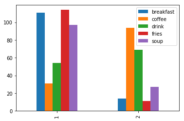


<p style="font-size:20px"><u style="color: steelblue">Explanation:</u></p>
Most people choose cereal for breakfast, expresso for coffee, soda for drink, Mcdonald’s fries for fries, and veggie soup for soup.

<p style="font-size:20px;"><u style="color: darkred">D. Calories Guessing</u></p>

<p style="font-size:15px;"><u style="color: black">D1. Chicken Calories </u></p>


```python
FoodData["calories_chicken"].value_counts()
```


    610    59
    720    32
    430    25
    265     9
    Name: calories_chicken, dtype: int64


```python
plt.figure(figsize=(10,8)) #调节图形大小
labels = [u'610 calories',u'720 calories',u'430 calories',u'265 calories'] #定义标签
sizes = [57,31,24,9] #每块值
colors = ['red','yellowgreen','lightskyblue','yellow'] #每块颜色定义
explode = (0,0.6,0,0) #将某一块分割出来，值越大分割出的间隙越大
patches,text1,text2 = plt.pie(sizes,
                      explode=explode,
                      labels=labels,
                      colors=colors,
                      autopct = '%3.2f%%', #数值保留固定小数位
                      shadow = True, #无阴影设置
                      startangle =90, #逆时针起始角度设置
                      pctdistance = 0.6) #数值距圆心半径倍数距离
#patches饼图的返回值，texts1饼图外label的文本，texts2饼图内部的文本
# x，y轴刻度设置一致，保证饼图为圆形
plt.axis('equal')
```


    (-1.1364330449247495,
     1.4578910437759949,
     -1.6198471154325416,
     1.1247546245444067)


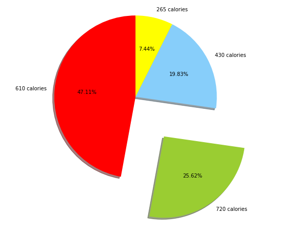


<p style="font-size:20px"><u style="color: steelblue">Explanation:</u></p>
It appears that only 25.62 percent people choose the right answer. Up to 47 percent people choose 610 calories.

<p style="font-size:15px;"><u style="color: black">D2. Scone Calories </u></p>


```python
FoodData["calories_scone"].value_counts()
```


    420.0    79
    980.0    23
    315.0    22
    Name: calories_scone, dtype: int64


```python
plt.figure(figsize=(10,8)) #调节图形大小
labels = [u'420 calories',u'980 calories',u'315 calories',u'107 calories'] #定义标签
sizes = [79,23,22,1] #每块值
colors = ['red','yellowgreen','lightskyblue','yellow'] #每块颜色定义
explode = (0,0,0.6,0) #将某一块分割出来，值越大分割出的间隙越大
patches,text1,text2 = plt.pie(sizes,
                      explode=explode,
                      labels=labels,
                      colors=colors,
                      autopct = '%3.2f%%', #数值保留固定小数位
                      shadow = True, #无阴影设置
                      startangle =90, #逆时针起始角度设置
                      pctdistance = 0.6) #数值距圆心半径倍数距离
#patches饼图的返回值，texts1饼图外label的文本，texts2饼图内部的文本
# x，y轴刻度设置一致，保证饼图为圆形
plt.axis('equal')
```


    (-1.1235264355634857,
     1.3688942258686614,
     -1.139062265419171,
     1.618186055248056)


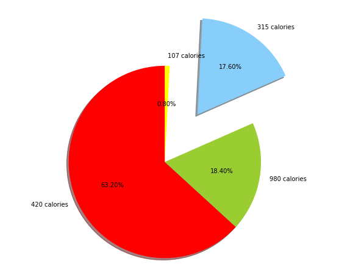


<p style="font-size:20px"><u style="color: steelblue">Explanation:</u></p>
It appears that only 17.6 percent people choose the right answer. Up to 63 percent people choose 420 calories.

<h2><center style="font-size:30px"><u style="color: coral">Dendrogram</u></center></h2>

We chose colums: eating_out, income, pay_meal_out to make our dendrogram.


```python
Dendrogram_data = FoodData[['eating_out','pay_meal_out','income']]

from sklearn.metrics.pairwise import euclidean_distances
Dendrogram_data_D = DataFrame(euclidean_distances(Dendrogram_data))
```


```python
from scipy.cluster.hierarchy import dendrogram, linkage, leaves_list
Z = linkage(Dendrogram_data_D, 'average')
plt.figure(figsize=(40, 100))
D = dendrogram(Z=Z, orientation="right", leaf_font_size=40)

```

    /Users/MrM/anaconda3/lib/python3.7/site-packages/ipykernel_launcher.py:2: ClusterWarning: scipy.cluster: The symmetric non-negative hollow observation matrix looks suspiciously like an uncondensed distance matrix
      


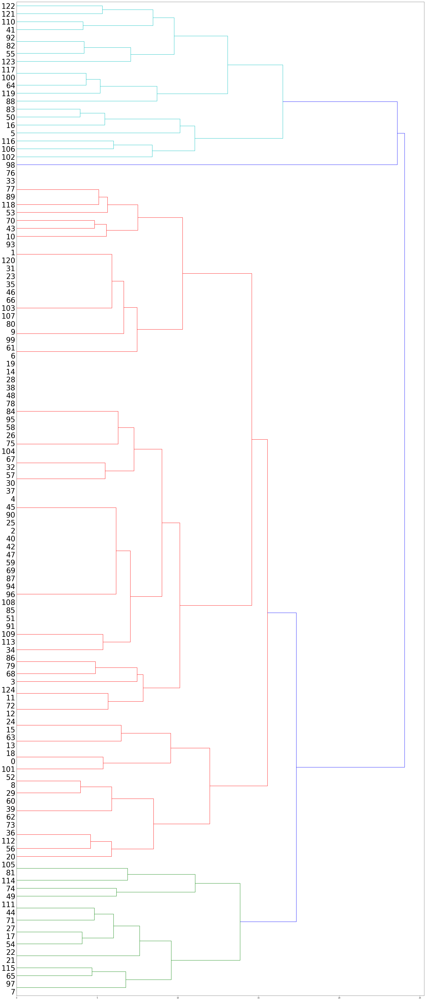


<p style="font-size:20px"><u style="color: steelblue">Explanation:</u></p>
By eating_out, income,and eating_out, We made this dendrogram to cluster our students into different group. It seems that we have four group in here.

<h2><center style="font-size:30px"><u style="color: coral">Step-by-step K-means</u></center></h2>

<h2><center style="font-size:19px"><u style="color: darkblue">First Iteration</u></center></h2>


```python
fig = plt.figure(figsize=(5,5))
plt.scatter(Dendrogram_data.eating_out,Dendrogram_data.pay_meal_out, edgecolor = 'black', s = 80)
plt.xlabel('eating_out')
plt.ylabel('pay_meal_out')
```


    Text(0, 0.5, 'pay_meal_out')


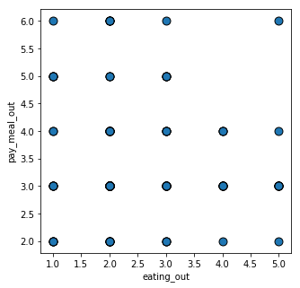


<p style="font-size:20px"><u style="color: steelblue">Explanation:</u></p>
We used eating_out and pay_meal_out columns to implement our K-means


```python
centroid1 = np.array([2,5])
centroid2 = np.array([1, 4])
centroid3 = np.array([3, 2])

fig = plt.figure(figsize=(5,5))
plt.scatter(Dendrogram_data.eating_out,Dendrogram_data.pay_meal_out, edgecolor = 'black', s = 80)
plt.xlabel('eating_out')
plt.ylabel('pay_meal_out')
circle1 = plt.Circle(centroid1, radius=0.15, edgecolor = 'black', fc='yellow')
circle2 = plt.Circle(centroid2, radius=0.15, edgecolor = 'black', fc='red')
circle3 = plt.Circle(centroid3, radius=0.15, edgecolor = 'black', fc='green')
plt.gca().add_patch(circle1)
plt.gca().add_patch(circle2)
plt.gca().add_patch(circle3)
```


    <matplotlib.patches.Circle at 0x1a251c9860>


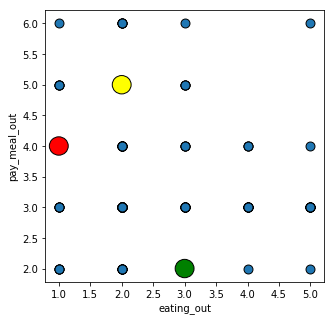


<p style="font-size:20px"><u style="color: steelblue">Explanation:</u></p>
We put random three points to calculate the distance. 


```python
Dendrogram_data["Dist_C1"] = np.sqrt((Dendrogram_data.eating_out - centroid1[0])**2 
                             + (Dendrogram_data.pay_meal_out - centroid1[1])**2)
Dendrogram_data["Dist_C2"] = np.sqrt((Dendrogram_data.eating_out - centroid2[0])**2 + 
                             (Dendrogram_data.pay_meal_out - centroid2[1])**2)
Dendrogram_data["Dist_C3"] = np.sqrt((Dendrogram_data.eating_out - centroid3[0])**2 + 
                             (Dendrogram_data.pay_meal_out - centroid3[1])**2)

Dendrogram_data["Association"] = np.where(
    (Dendrogram_data.Dist_C1 < Dendrogram_data.Dist_C2) & 
    (Dendrogram_data.Dist_C1 < Dendrogram_data.Dist_C3), 1, 
     np.where((Dendrogram_data.Dist_C2 < Dendrogram_data.Dist_C1) & 
    (Dendrogram_data.Dist_C2 < Dendrogram_data.Dist_C3) , 2, 3))
fig = plt.figure(figsize=(5,5))
 
# Create a colormap
colormap = np.array(['black', 'yellow', 'red', 'green'])
 
plt.scatter(Dendrogram_data.eating_out, Dendrogram_data.pay_meal_out, 
            c=colormap[Dendrogram_data.Association], edgecolor = 'black', s = 80)
plt.xlabel('eating_out')
plt.ylabel('pay_meal_out')
```

    /Users/MrM/anaconda3/lib/python3.7/site-packages/ipykernel_launcher.py:2: SettingWithCopyWarning: 
    A value is trying to be set on a copy of a slice from a DataFrame.
    Try using .loc[row_indexer,col_indexer] = value instead
    
    See the caveats in the documentation: http://pandas.pydata.org/pandas-docs/stable/indexing.html#indexing-view-versus-copy
      
    /Users/MrM/anaconda3/lib/python3.7/site-packages/ipykernel_launcher.py:4: SettingWithCopyWarning: 
    A value is trying to be set on a copy of a slice from a DataFrame.
    Try using .loc[row_indexer,col_indexer] = value instead
    
    See the caveats in the documentation: http://pandas.pydata.org/pandas-docs/stable/indexing.html#indexing-view-versus-copy
      after removing the cwd from sys.path.
    /Users/MrM/anaconda3/lib/python3.7/site-packages/ipykernel_launcher.py:6: SettingWithCopyWarning: 
    A value is trying to be set on a copy of a slice from a DataFrame.
    Try using .loc[row_indexer,col_indexer] = value instead
    
    See the caveats in the documentation: http://pandas.pydata.org/pandas-docs/stable/indexing.html#indexing-view-versus-copy
      
    /Users/MrM/anaconda3/lib/python3.7/site-packages/ipykernel_launcher.py:12: SettingWithCopyWarning: 
    A value is trying to be set on a copy of a slice from a DataFrame.
    Try using .loc[row_indexer,col_indexer] = value instead
    
    See the caveats in the documentation: http://pandas.pydata.org/pandas-docs/stable/indexing.html#indexing-view-versus-copy
      if sys.path[0] == '':


    Text(0, 0.5, 'pay_meal_out')


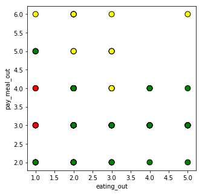


<p style="font-size:20px"><u style="color: steelblue">Explanation:</u></p>
After calculation of distance, we got three groups with different color.

<h2><center style="font-size:19px"><u style="color: darkblue">Second Iteration</u></center></h2>


```python
centroid1 = Dendrogram_data[Dendrogram_data.Association == 1][["eating_out", "pay_meal_out"]].mean()
centroid2 = Dendrogram_data[Dendrogram_data.Association == 2][["eating_out", "pay_meal_out"]].mean()
centroid3 = Dendrogram_data[Dendrogram_data.Association == 3][["eating_out", "pay_meal_out"]].mean()

fig = plt.figure(figsize=(5,5))

# Create a colormap
colormap = np.array(['black', 'yellow', 'red', 'green'])
 
plt.scatter(Dendrogram_data.eating_out,Dendrogram_data.pay_meal_out, c=colormap[Dendrogram_data.Association], edgecolor = 'black', s = 80)

#plt.scatter(Dendrogram_data.fav_food,Dendrogram_data.pay_meal_out, edgecolor = 'black', s = 80)

plt.xlabel('eating_out')
plt.ylabel('pay_meal_out')
circle1 = plt.Circle(centroid1, radius=0.1, edgecolor = 'black', fc='yellow')
circle2 = plt.Circle(centroid2, radius=0.1, edgecolor = 'black', fc='red')
circle3 = plt.Circle(centroid3, radius=0.1, edgecolor = 'black', fc='green')
plt.gca().add_patch(circle1)
plt.gca().add_patch(circle2)
plt.gca().add_patch(circle3)


```


    <matplotlib.patches.Circle at 0x1a20171390>


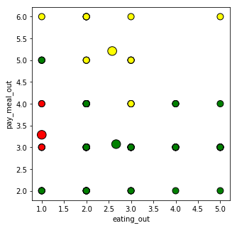


<p style="font-size:20px"><u style="color: steelblue">Explanation:</u></p>
After calculation of distance again, we moved the central point to the mean.

<h2><center style="font-size:19px"><u style="color: darkblue">3 Iteration</u></center></h2>


```python
Dendrogram_data["Dist_C1"] = np.sqrt((Dendrogram_data.eating_out - centroid1[0])**2 + (Dendrogram_data.pay_meal_out - centroid1[1])**2)
Dendrogram_data["Dist_C2"] = np.sqrt((Dendrogram_data.eating_out - centroid2[0])**2 + (Dendrogram_data.pay_meal_out - centroid2[1])**2)
Dendrogram_data["Dist_C3"] = np.sqrt((Dendrogram_data.eating_out - centroid3[0])**2 + (Dendrogram_data.pay_meal_out - centroid3[1])**2)
Dendrogram_data["Association"] = np.where((Dendrogram_data.Dist_C1 < Dendrogram_data.Dist_C2) & 
                                  (Dendrogram_data.Dist_C1 < Dendrogram_data.Dist_C3), 1, 
                                   np.where((Dendrogram_data.Dist_C2 < Dendrogram_data.Dist_C1) & 
                                  (Dendrogram_data.Dist_C2 < Dendrogram_data.Dist_C3) , 2, 3))
fig = plt.figure(figsize=(5,5))
 
# Create a colormap
colormap = np.array(['black', 'yellow', 'red', 'green'])
# Plot Sepal
plt.scatter(Dendrogram_data.eating_out,Dendrogram_data.pay_meal_out, c=colormap[Dendrogram_data.Association], edgecolor = 'black', s = 80)
plt.xlabel('eating_out')
plt.ylabel('pay_meal_out')
circle1 = plt.Circle(centroid1, radius=0.1, edgecolor = 'black', fc='yellow')
circle2 = plt.Circle(centroid2, radius=0.1, edgecolor = 'black', fc='red')
circle3 = plt.Circle(centroid3, radius=0.1, edgecolor = 'black', fc='green')
plt.gca().add_patch(circle1)
plt.gca().add_patch(circle2)
plt.gca().add_patch(circle3)
```

    /Users/MrM/anaconda3/lib/python3.7/site-packages/ipykernel_launcher.py:1: SettingWithCopyWarning: 
    A value is trying to be set on a copy of a slice from a DataFrame.
    Try using .loc[row_indexer,col_indexer] = value instead
    
    See the caveats in the documentation: http://pandas.pydata.org/pandas-docs/stable/indexing.html#indexing-view-versus-copy
      """Entry point for launching an IPython kernel.
    /Users/MrM/anaconda3/lib/python3.7/site-packages/ipykernel_launcher.py:2: SettingWithCopyWarning: 
    A value is trying to be set on a copy of a slice from a DataFrame.
    Try using .loc[row_indexer,col_indexer] = value instead
    
    See the caveats in the documentation: http://pandas.pydata.org/pandas-docs/stable/indexing.html#indexing-view-versus-copy
      
    /Users/MrM/anaconda3/lib/python3.7/site-packages/ipykernel_launcher.py:3: SettingWithCopyWarning: 
    A value is trying to be set on a copy of a slice from a DataFrame.
    Try using .loc[row_indexer,col_indexer] = value instead
    
    See the caveats in the documentation: http://pandas.pydata.org/pandas-docs/stable/indexing.html#indexing-view-versus-copy
      This is separate from the ipykernel package so we can avoid doing imports until
    /Users/MrM/anaconda3/lib/python3.7/site-packages/ipykernel_launcher.py:7: SettingWithCopyWarning: 
    A value is trying to be set on a copy of a slice from a DataFrame.
    Try using .loc[row_indexer,col_indexer] = value instead
    
    See the caveats in the documentation: http://pandas.pydata.org/pandas-docs/stable/indexing.html#indexing-view-versus-copy
      import sys


    <matplotlib.patches.Circle at 0x11d1719e8>


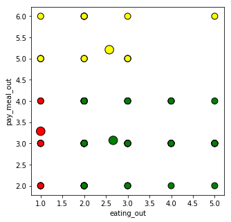


<p style="font-size:20px"><u style="color: steelblue">Explanation:</u></p>
After calculation of distance again, we moved the central point to the mean again

<h2><center style="font-size:19px"><u style="color: darkblue">4 Iteration</u></center></h2>


```python
centroid1 = Dendrogram_data[Dendrogram_data.Association == 1][["eating_out", "pay_meal_out"]].mean()
centroid2 = Dendrogram_data[Dendrogram_data.Association == 2][["eating_out", "pay_meal_out"]].mean()
centroid3 = Dendrogram_data[Dendrogram_data.Association == 3][["eating_out", "pay_meal_out"]].mean()
Dendrogram_data["Dist_C1"] = np.sqrt((Dendrogram_data.eating_out - centroid1[0])**2 + (Dendrogram_data.pay_meal_out - centroid1[1])**2)
Dendrogram_data["Dist_C2"] = np.sqrt((Dendrogram_data.eating_out - centroid2[0])**2 + (Dendrogram_data.pay_meal_out - centroid2[1])**2)
Dendrogram_data["Dist_C3"] = np.sqrt((Dendrogram_data.eating_out - centroid3[0])**2 + (Dendrogram_data.pay_meal_out - centroid3[1])**2)
Dendrogram_data["Association"] = np.where((Dendrogram_data.Dist_C1 < Dendrogram_data.Dist_C2) & 
                                  (Dendrogram_data.Dist_C1 < Dendrogram_data.Dist_C3), 1, 
                                   np.where((Dendrogram_data.Dist_C2 < Dendrogram_data.Dist_C1) & 
                                  (Dendrogram_data.Dist_C2 < Dendrogram_data.Dist_C3) , 2, 3))
fig = plt.figure(figsize=(5,5))
 
# Create a colormap
colormap = np.array(['black', 'yellow', 'red', 'green'])
 
# Plot Sepal
plt.scatter(Dendrogram_data.eating_out, Dendrogram_data.pay_meal_out, c=colormap[Dendrogram_data.Association], edgecolor = 'black', s = 80)
plt.xlabel('eating_out')
plt.ylabel('pay_meal_out')
circle1 = plt.Circle(centroid1, radius=0.1, edgecolor = 'black', fc='yellow')
circle2 = plt.Circle(centroid2, radius=0.1, edgecolor = 'black', fc='red')
circle3 = plt.Circle(centroid3, radius=0.1, edgecolor = 'black', fc='green')
plt.gca().add_patch(circle1)
plt.gca().add_patch(circle2)
plt.gca().add_patch(circle3)
```

    /Users/MrM/anaconda3/lib/python3.7/site-packages/ipykernel_launcher.py:4: SettingWithCopyWarning: 
    A value is trying to be set on a copy of a slice from a DataFrame.
    Try using .loc[row_indexer,col_indexer] = value instead
    
    See the caveats in the documentation: http://pandas.pydata.org/pandas-docs/stable/indexing.html#indexing-view-versus-copy
      after removing the cwd from sys.path.
    /Users/MrM/anaconda3/lib/python3.7/site-packages/ipykernel_launcher.py:5: SettingWithCopyWarning: 
    A value is trying to be set on a copy of a slice from a DataFrame.
    Try using .loc[row_indexer,col_indexer] = value instead
    
    See the caveats in the documentation: http://pandas.pydata.org/pandas-docs/stable/indexing.html#indexing-view-versus-copy
      """
    /Users/MrM/anaconda3/lib/python3.7/site-packages/ipykernel_launcher.py:6: SettingWithCopyWarning: 
    A value is trying to be set on a copy of a slice from a DataFrame.
    Try using .loc[row_indexer,col_indexer] = value instead
    
    See the caveats in the documentation: http://pandas.pydata.org/pandas-docs/stable/indexing.html#indexing-view-versus-copy
      
    /Users/MrM/anaconda3/lib/python3.7/site-packages/ipykernel_launcher.py:10: SettingWithCopyWarning: 
    A value is trying to be set on a copy of a slice from a DataFrame.
    Try using .loc[row_indexer,col_indexer] = value instead
    
    See the caveats in the documentation: http://pandas.pydata.org/pandas-docs/stable/indexing.html#indexing-view-versus-copy
      # Remove the CWD from sys.path while we load stuff.


    <matplotlib.patches.Circle at 0x10c967d68>


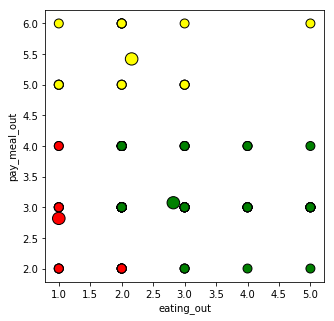


<p style="font-size:20px"><u style="color: steelblue">Explanation:</u></p>
After calculation of distance again, we moved the central point to the mean again. The central points are stil moving

<h2><center style="font-size:19px"><u style="color: darkblue">5 Iteration</u></center></h2>


```python
centroid1 = Dendrogram_data[Dendrogram_data.Association == 1][["eating_out", "pay_meal_out"]].mean()
centroid2 = Dendrogram_data[Dendrogram_data.Association == 2][["eating_out", "pay_meal_out"]].mean()
centroid3 = Dendrogram_data[Dendrogram_data.Association == 3][["eating_out", "pay_meal_out"]].mean()
Dendrogram_data["Dist_C1"] = np.sqrt((Dendrogram_data.eating_out - centroid1[0])**2 + (Dendrogram_data.pay_meal_out - centroid1[1])**2)
Dendrogram_data["Dist_C2"] = np.sqrt((Dendrogram_data.eating_out - centroid2[0])**2 + (Dendrogram_data.pay_meal_out - centroid2[1])**2)
Dendrogram_data["Dist_C3"] = np.sqrt((Dendrogram_data.eating_out - centroid3[0])**2 + (Dendrogram_data.pay_meal_out - centroid3[1])**2)
Dendrogram_data["Association"] = np.where((Dendrogram_data.Dist_C1 < Dendrogram_data.Dist_C2) & 
                                  (Dendrogram_data.Dist_C1 < Dendrogram_data.Dist_C3), 1, 
                                   np.where((Dendrogram_data.Dist_C2 < Dendrogram_data.Dist_C1) & 
                                  (Dendrogram_data.Dist_C2 < Dendrogram_data.Dist_C3) , 2, 3))
fig = plt.figure(figsize=(5,5))
 
# Create a colormap
colormap = np.array(['black', 'yellow', 'red', 'green'])
 
# Plot Sepal
plt.scatter(Dendrogram_data.eating_out, Dendrogram_data.pay_meal_out, c=colormap[Dendrogram_data.Association], edgecolor = 'black', s = 80)
plt.xlabel('eating_out')
plt.ylabel('pay_meal_out')
circle1 = plt.Circle(centroid1, radius=0.1, edgecolor = 'black', fc='yellow')
circle2 = plt.Circle(centroid2, radius=0.1, edgecolor = 'black', fc='red')
circle3 = plt.Circle(centroid3, radius=0.1, edgecolor = 'black', fc='green')
plt.gca().add_patch(circle1)
plt.gca().add_patch(circle2)
plt.gca().add_patch(circle3)
```

    /Users/MrM/anaconda3/lib/python3.7/site-packages/ipykernel_launcher.py:4: SettingWithCopyWarning: 
    A value is trying to be set on a copy of a slice from a DataFrame.
    Try using .loc[row_indexer,col_indexer] = value instead
    
    See the caveats in the documentation: http://pandas.pydata.org/pandas-docs/stable/indexing.html#indexing-view-versus-copy
      after removing the cwd from sys.path.
    /Users/MrM/anaconda3/lib/python3.7/site-packages/ipykernel_launcher.py:5: SettingWithCopyWarning: 
    A value is trying to be set on a copy of a slice from a DataFrame.
    Try using .loc[row_indexer,col_indexer] = value instead
    
    See the caveats in the documentation: http://pandas.pydata.org/pandas-docs/stable/indexing.html#indexing-view-versus-copy
      """
    /Users/MrM/anaconda3/lib/python3.7/site-packages/ipykernel_launcher.py:6: SettingWithCopyWarning: 
    A value is trying to be set on a copy of a slice from a DataFrame.
    Try using .loc[row_indexer,col_indexer] = value instead
    
    See the caveats in the documentation: http://pandas.pydata.org/pandas-docs/stable/indexing.html#indexing-view-versus-copy
      
    /Users/MrM/anaconda3/lib/python3.7/site-packages/ipykernel_launcher.py:10: SettingWithCopyWarning: 
    A value is trying to be set on a copy of a slice from a DataFrame.
    Try using .loc[row_indexer,col_indexer] = value instead
    
    See the caveats in the documentation: http://pandas.pydata.org/pandas-docs/stable/indexing.html#indexing-view-versus-copy
      # Remove the CWD from sys.path while we load stuff.


    <matplotlib.patches.Circle at 0x11d7065c0>


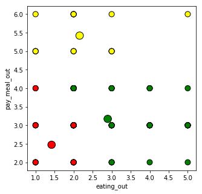


<p style="font-size:20px"><u style="color: steelblue">Explanation:</u></p>
After calculation of distance again, we moved the central point to the mean again

<h2><center style="font-size:19px"><u style="color: darkblue">6 Iteration</u></center></h2>


```python
centroid1 = Dendrogram_data[Dendrogram_data.Association == 1][["eating_out", "pay_meal_out"]].mean()
centroid2 = Dendrogram_data[Dendrogram_data.Association == 2][["eating_out", "pay_meal_out"]].mean()
centroid3 = Dendrogram_data[Dendrogram_data.Association == 3][["eating_out", "pay_meal_out"]].mean()
Dendrogram_data["Dist_C1"] = np.sqrt((Dendrogram_data.eating_out - centroid1[0])**2 + (Dendrogram_data.pay_meal_out - centroid1[1])**2)
Dendrogram_data["Dist_C2"] = np.sqrt((Dendrogram_data.eating_out - centroid2[0])**2 + (Dendrogram_data.pay_meal_out - centroid2[1])**2)
Dendrogram_data["Dist_C3"] = np.sqrt((Dendrogram_data.eating_out - centroid3[0])**2 + (Dendrogram_data.pay_meal_out - centroid3[1])**2)
Dendrogram_data["Association"] = np.where((Dendrogram_data.Dist_C1 < Dendrogram_data.Dist_C2) & 
                                  (Dendrogram_data.Dist_C1 < Dendrogram_data.Dist_C3), 1, 
                                   np.where((Dendrogram_data.Dist_C2 < Dendrogram_data.Dist_C1) & 
                                  (Dendrogram_data.Dist_C2 < Dendrogram_data.Dist_C3) , 2, 3))
fig = plt.figure(figsize=(5,5))
 
# Create a colormap
colormap = np.array(['black', 'yellow', 'red', 'green'])
 
# Plot Sepal
plt.scatter(Dendrogram_data.eating_out, Dendrogram_data.pay_meal_out, c=colormap[Dendrogram_data.Association], edgecolor = 'black', s = 80)
plt.xlabel('eating_out')
plt.ylabel('pay_meal_out')
circle1 = plt.Circle(centroid1, radius=0.1, edgecolor = 'black', fc='yellow')
circle2 = plt.Circle(centroid2, radius=0.1, edgecolor = 'black', fc='red')
circle3 = plt.Circle(centroid3, radius=0.1, edgecolor = 'black', fc='green')
plt.gca().add_patch(circle1)
plt.gca().add_patch(circle2)
plt.gca().add_patch(circle3)
```

    /Users/MrM/anaconda3/lib/python3.7/site-packages/ipykernel_launcher.py:4: SettingWithCopyWarning: 
    A value is trying to be set on a copy of a slice from a DataFrame.
    Try using .loc[row_indexer,col_indexer] = value instead
    
    See the caveats in the documentation: http://pandas.pydata.org/pandas-docs/stable/indexing.html#indexing-view-versus-copy
      after removing the cwd from sys.path.
    /Users/MrM/anaconda3/lib/python3.7/site-packages/ipykernel_launcher.py:5: SettingWithCopyWarning: 
    A value is trying to be set on a copy of a slice from a DataFrame.
    Try using .loc[row_indexer,col_indexer] = value instead
    
    See the caveats in the documentation: http://pandas.pydata.org/pandas-docs/stable/indexing.html#indexing-view-versus-copy
      """
    /Users/MrM/anaconda3/lib/python3.7/site-packages/ipykernel_launcher.py:6: SettingWithCopyWarning: 
    A value is trying to be set on a copy of a slice from a DataFrame.
    Try using .loc[row_indexer,col_indexer] = value instead
    
    See the caveats in the documentation: http://pandas.pydata.org/pandas-docs/stable/indexing.html#indexing-view-versus-copy
      
    /Users/MrM/anaconda3/lib/python3.7/site-packages/ipykernel_launcher.py:10: SettingWithCopyWarning: 
    A value is trying to be set on a copy of a slice from a DataFrame.
    Try using .loc[row_indexer,col_indexer] = value instead
    
    See the caveats in the documentation: http://pandas.pydata.org/pandas-docs/stable/indexing.html#indexing-view-versus-copy
      # Remove the CWD from sys.path while we load stuff.


    <matplotlib.patches.Circle at 0x11d85d860>


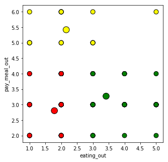


<h2><center style="font-size:19px"><u style="color: darkblue">6 Iteration</u></center></h2>


```python
centroid1 = Dendrogram_data[Dendrogram_data.Association == 1][["eating_out", "pay_meal_out"]].mean()
centroid2 = Dendrogram_data[Dendrogram_data.Association == 2][["eating_out", "pay_meal_out"]].mean()
centroid3 = Dendrogram_data[Dendrogram_data.Association == 3][["eating_out", "pay_meal_out"]].mean()
Dendrogram_data["Dist_C1"] = np.sqrt((Dendrogram_data.eating_out - centroid1[0])**2 + (Dendrogram_data.pay_meal_out - centroid1[1])**2)
Dendrogram_data["Dist_C2"] = np.sqrt((Dendrogram_data.eating_out - centroid2[0])**2 + (Dendrogram_data.pay_meal_out - centroid2[1])**2)
Dendrogram_data["Dist_C3"] = np.sqrt((Dendrogram_data.eating_out - centroid3[0])**2 + (Dendrogram_data.pay_meal_out - centroid3[1])**2)
Dendrogram_data["Association"] = np.where((Dendrogram_data.Dist_C1 < Dendrogram_data.Dist_C2) & 
                                  (Dendrogram_data.Dist_C1 < Dendrogram_data.Dist_C3), 1, 
                                   np.where((Dendrogram_data.Dist_C2 < Dendrogram_data.Dist_C1) & 
                                  (Dendrogram_data.Dist_C2 < Dendrogram_data.Dist_C3) , 2, 3))
fig = plt.figure(figsize=(5,5))
 
# Create a colormap
colormap = np.array(['black', 'yellow', 'red', 'green'])
 
# Plot Sepal
plt.scatter(Dendrogram_data.eating_out, Dendrogram_data.pay_meal_out, c=colormap[Dendrogram_data.Association], edgecolor = 'black', s = 80)
plt.xlabel('eating_out')
plt.ylabel('pay_meal_out')
circle1 = plt.Circle(centroid1, radius=0.1, edgecolor = 'black', fc='yellow')
circle2 = plt.Circle(centroid2, radius=0.1, edgecolor = 'black', fc='red')
circle3 = plt.Circle(centroid3, radius=0.1, edgecolor = 'black', fc='green')
plt.gca().add_patch(circle1)
plt.gca().add_patch(circle2)
plt.gca().add_patch(circle3)
```

    /Users/MrM/anaconda3/lib/python3.7/site-packages/ipykernel_launcher.py:4: SettingWithCopyWarning: 
    A value is trying to be set on a copy of a slice from a DataFrame.
    Try using .loc[row_indexer,col_indexer] = value instead
    
    See the caveats in the documentation: http://pandas.pydata.org/pandas-docs/stable/indexing.html#indexing-view-versus-copy
      after removing the cwd from sys.path.
    /Users/MrM/anaconda3/lib/python3.7/site-packages/ipykernel_launcher.py:5: SettingWithCopyWarning: 
    A value is trying to be set on a copy of a slice from a DataFrame.
    Try using .loc[row_indexer,col_indexer] = value instead
    
    See the caveats in the documentation: http://pandas.pydata.org/pandas-docs/stable/indexing.html#indexing-view-versus-copy
      """
    /Users/MrM/anaconda3/lib/python3.7/site-packages/ipykernel_launcher.py:6: SettingWithCopyWarning: 
    A value is trying to be set on a copy of a slice from a DataFrame.
    Try using .loc[row_indexer,col_indexer] = value instead
    
    See the caveats in the documentation: http://pandas.pydata.org/pandas-docs/stable/indexing.html#indexing-view-versus-copy
      
    /Users/MrM/anaconda3/lib/python3.7/site-packages/ipykernel_launcher.py:10: SettingWithCopyWarning: 
    A value is trying to be set on a copy of a slice from a DataFrame.
    Try using .loc[row_indexer,col_indexer] = value instead
    
    See the caveats in the documentation: http://pandas.pydata.org/pandas-docs/stable/indexing.html#indexing-view-versus-copy
      # Remove the CWD from sys.path while we load stuff.


    <matplotlib.patches.Circle at 0x1a203ceeb8>


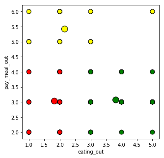


<h2><center style="font-size:19px"><u style="color: darkblue">Done</u></center></h2>


```python
centroid1 = Dendrogram_data[Dendrogram_data.Association == 1][["eating_out", "pay_meal_out"]].mean()
centroid2 = Dendrogram_data[Dendrogram_data.Association == 2][["eating_out", "pay_meal_out"]].mean()
centroid3 = Dendrogram_data[Dendrogram_data.Association == 3][["eating_out", "pay_meal_out"]].mean()
Dendrogram_data["Dist_C1"] = np.sqrt((Dendrogram_data.eating_out - centroid1[0])**2 + (Dendrogram_data.pay_meal_out - centroid1[1])**2)
Dendrogram_data["Dist_C2"] = np.sqrt((Dendrogram_data.eating_out - centroid2[0])**2 + (Dendrogram_data.pay_meal_out - centroid2[1])**2)
Dendrogram_data["Dist_C3"] = np.sqrt((Dendrogram_data.eating_out - centroid3[0])**2 + (Dendrogram_data.pay_meal_out - centroid3[1])**2)
Dendrogram_data["Association"] = np.where((Dendrogram_data.Dist_C1 < Dendrogram_data.Dist_C2) & 
                                  (Dendrogram_data.Dist_C1 < Dendrogram_data.Dist_C3), 1, 
                                   np.where((Dendrogram_data.Dist_C2 < Dendrogram_data.Dist_C1) & 
                                  (Dendrogram_data.Dist_C2 < Dendrogram_data.Dist_C3) , 2, 3))
fig = plt.figure(figsize=(5,5))
 
# Create a colormap
colormap = np.array(['black', 'yellow', 'red', 'green'])
 
# Plot Sepal
plt.scatter(Dendrogram_data.eating_out, Dendrogram_data.pay_meal_out, c=colormap[Dendrogram_data.Association], edgecolor = 'black', s = 80)
plt.xlabel('eating_out')
plt.ylabel('pay_meal_out')
circle1 = plt.Circle(centroid1, radius=0.1, edgecolor = 'black', fc='yellow')
circle2 = plt.Circle(centroid2, radius=0.1, edgecolor = 'black', fc='red')
circle3 = plt.Circle(centroid3, radius=0.1, edgecolor = 'black', fc='green')
plt.gca().add_patch(circle1)
plt.gca().add_patch(circle2)
plt.gca().add_patch(circle3)
```

    /Users/MrM/anaconda3/lib/python3.7/site-packages/ipykernel_launcher.py:4: SettingWithCopyWarning: 
    A value is trying to be set on a copy of a slice from a DataFrame.
    Try using .loc[row_indexer,col_indexer] = value instead
    
    See the caveats in the documentation: http://pandas.pydata.org/pandas-docs/stable/indexing.html#indexing-view-versus-copy
      after removing the cwd from sys.path.
    /Users/MrM/anaconda3/lib/python3.7/site-packages/ipykernel_launcher.py:5: SettingWithCopyWarning: 
    A value is trying to be set on a copy of a slice from a DataFrame.
    Try using .loc[row_indexer,col_indexer] = value instead
    
    See the caveats in the documentation: http://pandas.pydata.org/pandas-docs/stable/indexing.html#indexing-view-versus-copy
      """
    /Users/MrM/anaconda3/lib/python3.7/site-packages/ipykernel_launcher.py:6: SettingWithCopyWarning: 
    A value is trying to be set on a copy of a slice from a DataFrame.
    Try using .loc[row_indexer,col_indexer] = value instead
    
    See the caveats in the documentation: http://pandas.pydata.org/pandas-docs/stable/indexing.html#indexing-view-versus-copy
      
    /Users/MrM/anaconda3/lib/python3.7/site-packages/ipykernel_launcher.py:10: SettingWithCopyWarning: 
    A value is trying to be set on a copy of a slice from a DataFrame.
    Try using .loc[row_indexer,col_indexer] = value instead
    
    See the caveats in the documentation: http://pandas.pydata.org/pandas-docs/stable/indexing.html#indexing-view-versus-copy
      # Remove the CWD from sys.path while we load stuff.


    <matplotlib.patches.Circle at 0x1a20e3cf98>


<p style="font-size:20px"><u style="color: steelblue">Explanation:</u></p>
<br>
Finally, the plot is not changing anymore, we have three groups of students. For this plot, we can make three coupons for three different students. For example, yellow group students pay more for meal out that we can send them the coupon which is cheaper like 10%. This because the students may not care about how much coupon they got, they will still pay more for meal out.  For green group, students may more frequence eat out but pay less than yellow group. we can send them the coupon which is higher than coupon yellow group got. Then, for red group, the coupon will be higher than yellow and green. We can give like 20% discount coupon that may attract them to eat.

<h2><center style="font-size:30px"><u style="color: coral">sklearn.cluster</u></center></h2>


```python
from sklearn.cluster import KMeans
model = KMeans(n_clusters = 3)
model.fit(Dendrogram_data)
```


    KMeans(algorithm='auto', copy_x=True, init='k-means++', max_iter=300,
        n_clusters=3, n_init=10, n_jobs=None, precompute_distances='auto',
        random_state=None, tol=0.0001, verbose=0)


```python
fig = plt.figure(figsize=(5, 5))
 
# Create a colormap
colormap = np.array(['red', 'green', 'yellow'])
 
plt.scatter(Dendrogram_data.eating_out, Dendrogram_data.pay_meal_out, c=colormap[model.labels_], edgecolor = 'black', s = 80)
plt.title('K Mean Classification')
plt.xlabel('eating_out')
plt.ylabel('pay_meal_out')
```


    Text(0, 0.5, 'pay_meal_out')


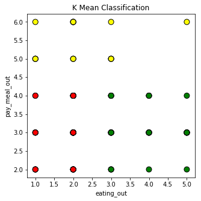


<p style="font-size:20px"><u style="color: steelblue">Explanation:</u></p>
By using sklearn.cluster, we can get the same result of step by step K-mean function easily.

<h2><center style="font-size:30px"><u style="color: coral">Prediction</u></center></h2>


```python
Dendrogram_dataP=FoodData[['eating_out','pay_meal_out','income','weight']]
```


```python
from sklearn.cluster import KMeans
model = KMeans(n_clusters = 5)
model.fit(Dendrogram_dataP)
```


    KMeans(algorithm='auto', copy_x=True, init='k-means++', max_iter=300,
        n_clusters=5, n_init=10, n_jobs=None, precompute_distances='auto',
        random_state=None, tol=0.0001, verbose=0)


### 1


```python
colormap = np.array(['yellow', 'red', 'blue','magenta','black'])

eating_out = float(input('eating_out: '))
pay_meal_out = float(input('pay_meal_out: '))
income = float(input('income: '))
weight = float(input('weight: '))
   
data_class = model.predict(np.array([eating_out, pay_meal_out,income,weight]).reshape(1,-1))[0]
colormap[data_class]
```

    eating_out: 2
    pay_meal_out: 7
    income: 6
    weight: 210


    'yellow'


### 2


```python
eating_out = float(input('eating_out: '))
pay_meal_out = float(input('pay_meal_out: '))
income = float(input('income: '))
weight = float(input('weight: '))
   
data_class = model.predict(np.array([eating_out, pay_meal_out,income,weight]).reshape(1,-1))[0]
colormap[data_class]
```

    eating_out: 4
    pay_meal_out: 7
    income: 9
    weight: 199


    'yellow'


### 3.


```python
eating_out = float(input('eating_out: '))
pay_meal_out = float(input('pay_meal_out: '))
income = float(input('income: '))
weight = float(input('weight: '))
   
data_class = model.predict(np.array([eating_out, pay_meal_out,income,weight]).reshape(1,-1))[0]
colormap[data_class]
```

    eating_out: 1
    pay_meal_out: 6
    income: 8
    weight: 190


    'yellow'


### 4.


```python
eating_out = float(input('eating_out: '))
pay_meal_out = float(input('pay_meal_out: '))
income = float(input('income: '))
weight = float(input('weight: '))
   
data_class = model.predict(np.array([eating_out, pay_meal_out,income,weight]).reshape(1,-1))[0]
colormap[data_class]
```

    eating_out: 9
    pay_meal_out: 8
    income: 9
    weight: 210


    'yellow'


### 5.


```python
eating_out = float(input('eating_out: '))
pay_meal_out = float(input('pay_meal_out: '))
income = float(input('income: '))
weight = float(input('weight: '))
   
data_class = model.predict(np.array([eating_out, pay_meal_out,income,weight]).reshape(1,-1))[0]
colormap[data_class]
```

    eating_out: 3
    pay_meal_out: 7
    income: 8
    weight: 199


    'yellow'


6.


```python
eating_out = float(input('eating_out: '))
pay_meal_out = float(input('pay_meal_out: '))
income = float(input('income: '))
weight = float(input('weight: '))
   
data_class = model.predict(np.array([eating_out, pay_meal_out,income,weight]).reshape(1,-1))[0]
colormap[data_class]
```

    eating_out: 4
    pay_meal_out: 7
    income: 8
    weight: 188


    'yellow'


7.


```python
eating_out = float(input('eating_out: '))
pay_meal_out = float(input('pay_meal_out: '))
income = float(input('income: '))
weight = float(input('weight: '))
   
data_class = model.predict(np.array([eating_out, pay_meal_out,income,weight]).reshape(1,-1))[0]
colormap[data_class]
```

    eating_out: 4
    pay_meal_out: 3
    income: 8
    weight: 210


    'yellow'


8.


```python
eating_out = float(input('eating_out: '))
pay_meal_out = float(input('pay_meal_out: '))
income = float(input('income: '))
weight = float(input('weight: '))
   
data_class = model.predict(np.array([eating_out, pay_meal_out,income,weight]).reshape(1,-1))[0]
colormap[data_class]
```

    eating_out: 4
    pay_meal_out: 7
    income: 5
    weight: 220


    'black'


9.


```python
eating_out = float(input('eating_out: '))
pay_meal_out = float(input('pay_meal_out: '))
income = float(input('income: '))
weight = float(input('weight: '))
   
data_class = model.predict(np.array([eating_out, pay_meal_out,income,weight]).reshape(1,-1))[0]
colormap[data_class]
```

    eating_out: 4
    pay_meal_out: 4
    income: 5
    weight: 188


    'yellow'


10.


```python
eating_out = float(input('eating_out: '))
pay_meal_out = float(input('pay_meal_out: '))
income = float(input('income: '))
weight = float(input('weight: '))
   
data_class = model.predict(np.array([eating_out, pay_meal_out,income,weight]).reshape(1,-1))[0]
colormap[data_class]
```

    eating_out: 3
    pay_meal_out: 4
    income: 56
    weight: 166


    'magenta'


#### <p style="font-size:20px"><u style="color: steelblue">Explanation:</u></p>
By this prediction function, if we have the score of eating out, pay meal out, income and weight, we can prediction the student belong to which group. Then base on that group to email the coupon. We have five different coupons with different discount.

<h2><center style="font-size:30px"><u style="color: coral">2D prediction mesh</u></center></h2>


```python
Dendrogram_data_D = FoodData[['eating_out','pay_meal_out']]
```


```python
model = KMeans(n_clusters = 5)
model.fit(Dendrogram_data_D)
```


    KMeans(algorithm='auto', copy_x=True, init='k-means++', max_iter=300,
        n_clusters=5, n_init=10, n_jobs=None, precompute_distances='auto',
        random_state=None, tol=0.0001, verbose=0)


```python
fig = plt.figure(figsize=(5, 5))
 
# Create a colormap
colormap = np.array(['red', 'green', 'yellow','blue','black'])
 
plt.scatter(Dendrogram_data_D.eating_out, Dendrogram_data_D.pay_meal_out, c=colormap[model.labels_], edgecolor = 'black', s = 80)
plt.title('K Mean Classification')
plt.xlabel('eating_out')
plt.ylabel('pay_meal_out')
```


    Text(0, 0.5, 'pay_meal_out')


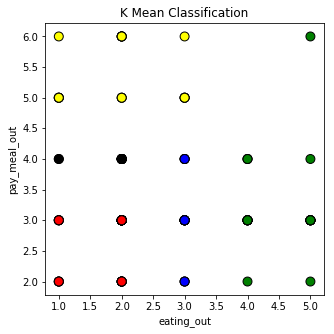


```python
def plotMesh():
    h = 0.05
    # Create color maps
    cmap_light = ListedColormap(['#ffffcc', '#ff8080','#ccd9ff','#f5ccff','#aaaaaa'])
    colormap = np.array(['yellow', 'red', 'blue','magenta','black'])

    x_min, x_max = Dendrogram_data_D.eating_out.min() - 1, Dendrogram_data_D.eating_out.max() + 1
    y_min, y_max = Dendrogram_data_D.pay_meal_out.min() - 1, Dendrogram_data_D.pay_meal_out.max() + 1
    xx, yy = np.meshgrid(np.arange(x_min, x_max, h),np.arange(y_min, y_max, h))
    Z = model.predict(np.c_[xx.ravel(), yy.ravel()])

    # Put the result into a color plot
    Z = Z.reshape(xx.shape)
    fig = plt.figure()
    plt.pcolormesh(xx, yy, Z, cmap = cmap_light)

    # Plot also the training points
    plt.scatter(Dendrogram_data_D.eating_out, Dendrogram_data_D.pay_meal_out, c = colormap[model.labels_], edgecolor = 'black', s = 120)
    plt.xlim(xx.min(), xx.max())
    plt.ylim(yy.min(), yy.max())
    plt.title("3-Class classification \n(k = %i)\n\
    Loan 1 - Yellow, Loan 2 - Red, Loan 3 - Blue" % (3))
    plt.xlabel('fav_food')
    plt.ylabel('pay_meal_out')
    
    
plotMesh()
```


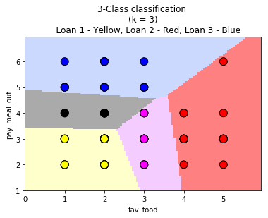


<p style="font-size:20px"><u style="color: steelblue">Explanation:</u></p>
We used two columns eating_out, pay_meal_out to create the 2D prediction mesh which let us to identify which student belongs to which group. Then, we can send them coupon by this engine

<h2><center style="font-size:30px"><u style="color: coral">Summary & Recommandation</u></center></h2>

#### In four different aspects of exploration, we found students’ cuisine type is America the most. And, most students like Italian food. The number of students up to 100 like it. Most interesting part is word association. For breakfast, student choose cereal. 
#### For drink, most people chose soda and for fries, people would associate with McDonald’s fries. In calories guessing part, up to 47 percent student thought chicken is 610 calories, and only 25 percent students chose the right answer. 
#### For scone calories, only 17.6 percent people choose the right answer, 63 percent students chose 420 calories. It seems that people don’t know what actually calories they are taking. 
#### In dendrogram part, we used the columns : eating out, income, pay meal out to draw our dendrogram first. By different color, we can see 4 different groups. 
#### Next, we implement the algorithm of k-mean with two columns: eating out and pay meal out. After 6 times to calculate, we got a solid plot. Then, we used sklearn.cluster library to check our algorithm is right or not. Then, the result are the same. So, we can use that to do prediction. 
#### Yellow group students pay more for meal out that we can send them the coupon which is cheaper like 10%. This because the students may not care about how much coupon they got, they will still pay more for meal out.  For green group, students may more frequence eat out but pay less than yellow group. we can send them the coupon which is higher than coupon yellow group got. Then, for red group, the coupon will be higher than yellow and green. We can give like 20% discount coupon that may attract them to eat. 
#### For prediction, we want to predict what type of students we should send the coupon to attract them to eat. So, I used eating_out, pay_meal_out, income, and weight to predict students charactics. The end we used two valuables to create our 2D prediction mesh which can let us to predict which student belongs to which group easily.
#### For recommandation, We will recommand send the coupon to the students who has higher score of eat out and pay meal out. Also, we can consider the income. The students who has higher income may choose to eat ouside usually. But, I will suggest them to collect more information from students that may help us to build more stable engine for engine.
