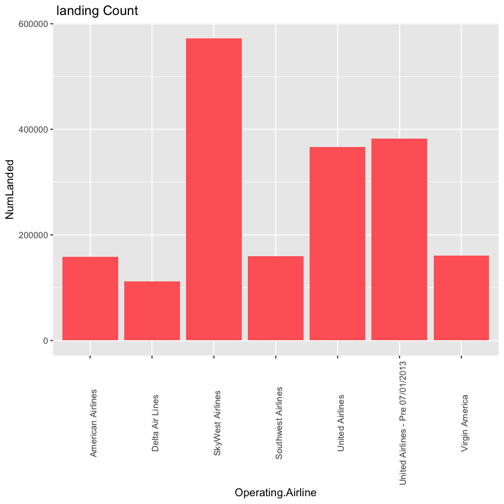
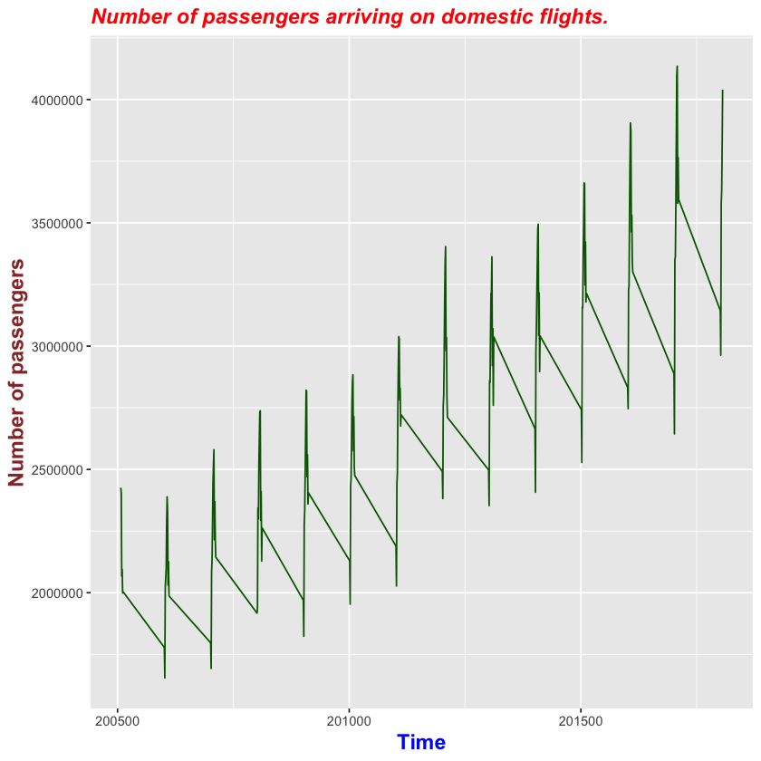
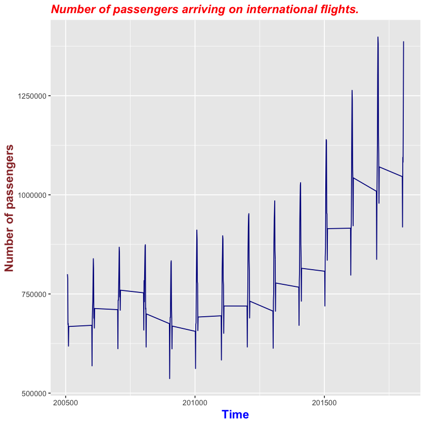
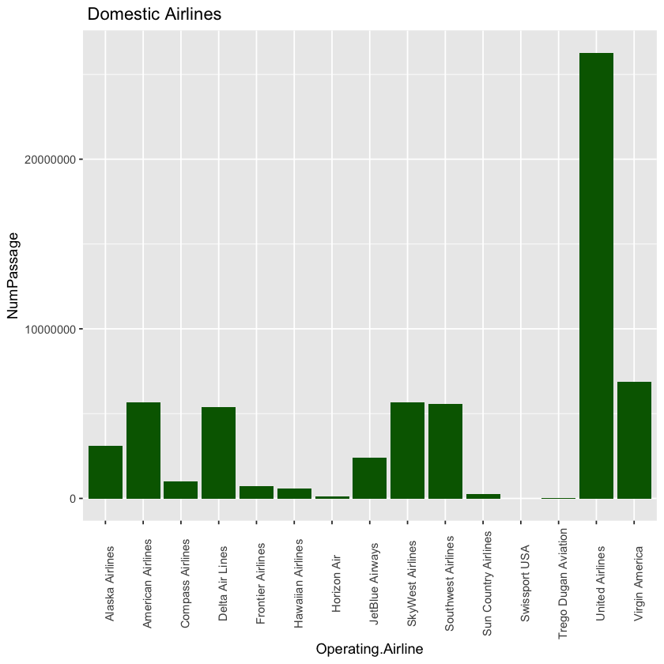
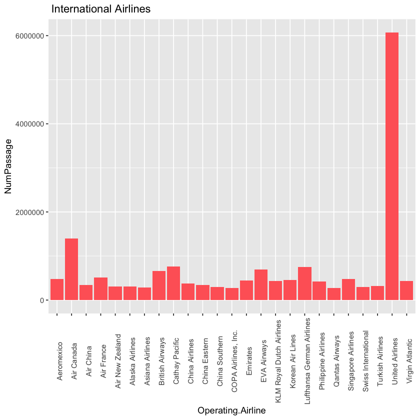
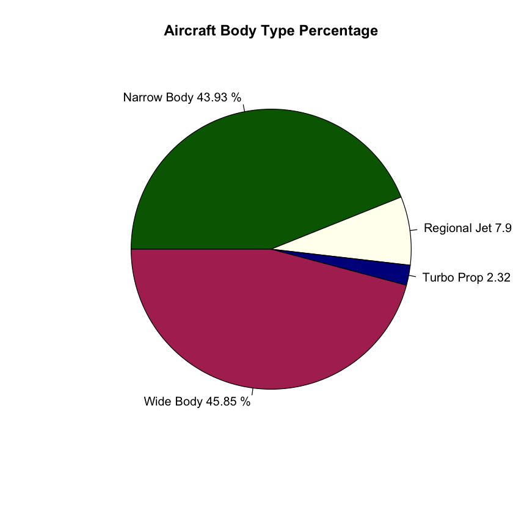
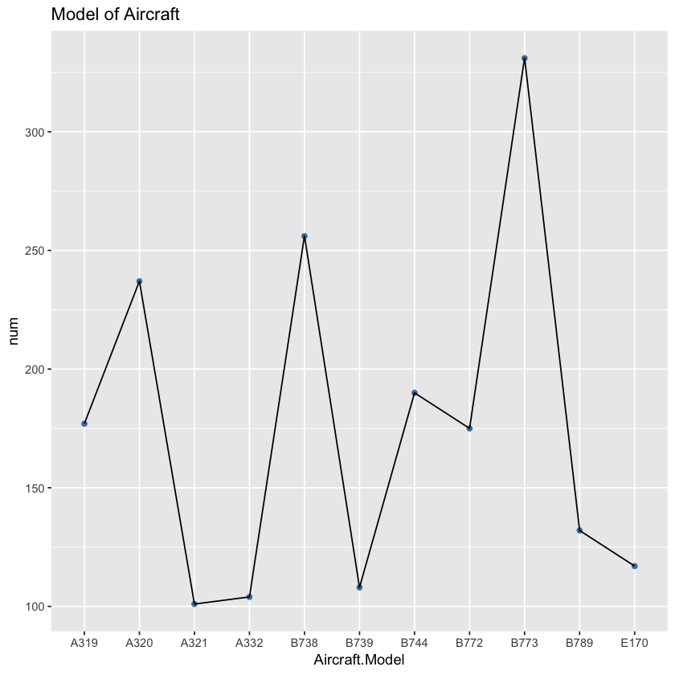
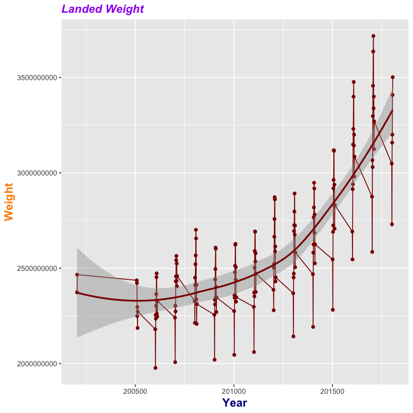
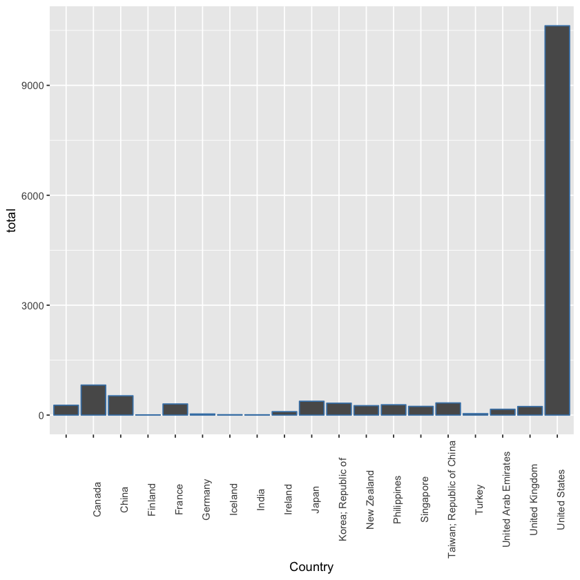

# ========San Francisco Airport traffic analysis==============

## Analyzed by MARCO LIN

#### San Fransico Airport is one of the significant airports in the world. San Mateo Country is considering an expansion to this airport. we are participating in a hackathon with their dataset of SFO to offer the most comprehensive solution that depicts the insights of the flights and provides recommendations. 
#### In this report, we will start by analyzing four aspects of data: GEO Region, Domestic and International Population Tendency, Type of Airplanes, and the Ranking of Landed Weight, in order to understand the data in general.
#### In addition, we will join various dataset to explore if there is any valuable data for our analysis. Especially, we will find out the "Elite" flights for the airport. The elite flights will be the flight which has higher number of landing count.
#### We will do logical segmentation to explain step by step. The end of report will come with summary and recommendations.

## 1.) =====================Preparation=========================


```R
library(tidyverse)
options(scipen=999)
library(IRdisplay)
```

    ─ Attaching packages ──────────────────── tidyverse 1.2.1 ─
    ✔ ggplot2 3.0.0     ✔ purrr   0.2.5
    ✔ tibble  1.4.2     ✔ dplyr   0.7.6
    ✔ tidyr   0.8.1     ✔ stringr 1.3.1
    ✔ readr   1.1.1     ✔ forcats 0.3.0
    ─ Conflicts ───────────────────── tidyverse_conflicts() ─
    ✖ dplyr::filter() masks stats::filter()
    ✖ dplyr::lag()    masks stats::lag()


```R
Airlines <- read.csv("~/project-ionic/R/week5/Airlines.csv")
```


```R
countries <- read.csv("~/project-ionic/R/week5/Countries of the World.csv")
```


```R
landings <- read.csv("~/project-ionic/R/week5/air-traffic-landings-statistics.csv")
```


```R
passagers <- read.csv("~/project-ionic/R/week5/air-traffic-passenger-statistics.csv")
```


```R
head (Airlines, 30)
names(Airlines)
```


<table>
<thead><tr><th scope=col>Name</th><th scope=col>ICAO</th><th scope=col>IATA</th><th scope=col>CallSign</th><th scope=col>Country</th><th scope=col>Founded</th><th scope=col>Destinations</th><th scope=col>Fleet.Size</th></tr></thead>
<tbody>
	<tr><td>Air Vanuatu                             </td><td>AVN                                     </td><td>NF                                      </td><td>AIR VAN                                 </td><td>Vanuatu                                 </td><td>1981                                    </td><td> 33                                     </td><td>  6                                     </td></tr>
	<tr><td>Atlantic Airways                        </td><td>FLI                                     </td><td>RC                                      </td><td>FAROELINE                               </td><td>Faroe Islands                           </td><td>1987                                    </td><td>  9                                     </td><td>  5                                     </td></tr>
	<tr><td>Express.Net Airlines                    </td><td>XNA                                     </td><td>                                        </td><td>EXPRESSNET                              </td><td>                                        </td><td>1972                                    </td><td> NA                                     </td><td>  4                                     </td></tr>
	<tr><td>Sabah Air                               </td><td>SAX                                     </td><td>SA                                      </td><td>SABAH AIR                               </td><td>Malaysia                                </td><td>1975                                    </td><td> NA                                     </td><td> 12                                     </td></tr>
	<tr><td>Air Vega                                </td><td>                                        </td><td>                                        </td><td>                                        </td><td>                                        </td><td>2012                                    </td><td> NA                                     </td><td>  1                                     </td></tr>
	<tr><td>Corporate Flight Management             </td><td>VTE                                     </td><td>                                        </td><td>VOLUNTEER                               </td><td>                                        </td><td>1982                                    </td><td> NA                                     </td><td> 27                                     </td></tr>
	<tr><td>ExpressJet                              </td><td>ASQ                                     </td><td>EV                                      </td><td>ACEY                                    </td><td>                                        </td><td>1979                                    </td><td>194                                     </td><td>401                                     </td></tr>
	<tr><td>Hageland Aviation Services              </td><td>HAG                                     </td><td>H6                                      </td><td>HAGELAND                                </td><td>United States                           </td><td>1981                                    </td><td> 76                                     </td><td> 33                                     </td></tr>
	<tr><td>Jota Aviation                           </td><td>ENZ                                     </td><td>                                        </td><td>ENZO                                    </td><td>                                        </td><td>2009                                    </td><td> NA                                     </td><td>  7                                     </td></tr>
	<tr><td>Links Air                               </td><td>LNQ                                     </td><td>W2                                      </td><td>FASTLINK                                </td><td>                                        </td><td>1983                                    </td><td>  2                                     </td><td>  3                                     </td></tr>
	<tr><td>MyTravelLite Airlines                   </td><td>MYL                                     </td><td>VZ                                      </td><td>MY LITE                                 </td><td>                                        </td><td>2002                                    </td><td> 10                                     </td><td>  4                                     </td></tr>
	<tr><td>Sabang Merauke Raya Air Charter         </td><td>SMC                                     </td><td>                                        </td><td>SAMER                                   </td><td>                                        </td><td>1969                                    </td><td> NA                                     </td><td> NA                                     </td></tr>
	<tr><td>World Atlantic Airlines                 </td><td>WAL                                     </td><td>K8                                      </td><td>DORAL                                   </td><td>                                        </td><td>2002                                    </td><td> NA                                     </td><td>  5                                     </td></tr>
	<tr><td>28th Air Detachment                     </td><td>BGF                                     </td><td>                                        </td><td>BULGARIAN                               </td><td>                                        </td><td>1972                                    </td><td> NA                                     </td><td>  5                                     </td></tr>
	<tr><td>Atlantic Express (airline)              </td><td>SBV                                     </td><td>                                        </td><td>RIPPLE                                  </td><td>                                        </td><td>1985                                    </td><td> NA                                     </td><td>  2                                     </td></tr>
	<tr><td>Brock Air Services                      </td><td>BRD                                     </td><td>                                        </td><td>BROCK AIR                               </td><td>                                        </td><td>1978                                    </td><td> NA                                     </td><td>  2                                     </td></tr>
	<tr><td>Corsair International                   </td><td>CRL                                     </td><td>SS                                      </td><td>CORSAIR                                 </td><td>France                                  </td><td>1981                                    </td><td>  9                                     </td><td>  7                                     </td></tr>
	<tr><td>EZAir                                   </td><td>EZR                                     </td><td>EZ                                      </td><td>EZ AIR                                  </td><td>                                        </td><td>2000                                    </td><td>  8                                     </td><td>  3                                     </td></tr>
	<tr><td>Hahn Air                                </td><td>HHN                                     </td><td>HR                                      </td><td>ROOSTER                                 </td><td>Germany                                 </td><td>1994                                    </td><td> NA                                     </td><td> NA                                     </td></tr>
	<tr><td>Joy Air                                 </td><td>JOY                                     </td><td>JR                                      </td><td>JOY AIR                                 </td><td>                                        </td><td>2008                                    </td><td> 17                                     </td><td>  8                                     </td></tr>
	<tr><td>Trans-Florida Airlines                  </td><td>TFA                                     </td><td>                                        </td><td>TRANS FLORIDA                           </td><td>                                        </td><td>1966                                    </td><td> NA                                     </td><td>  2                                     </td></tr>
	<tr><td>WOW air                                 </td><td>WOW                                     </td><td>WW                                      </td><td>WOW AIR                                 </td><td>                                        </td><td>2011                                    </td><td> 23                                     </td><td>  5                                     </td></tr>
	<tr><td>Brussels Airlines                       </td><td>BEL                                     </td><td>SN                                      </td><td>BEELINE                                 </td><td>Belgium                                 </td><td>2006                                    </td><td> 76                                     </td><td> 48                                     </td></tr>
	<tr><td>Hainan Airlines                         </td><td>CHH                                     </td><td>HU                                      </td><td>HAINAN                                  </td><td>China                                   </td><td>1989                                    </td><td> 90                                     </td><td>147                                     </td></tr>
	<tr><td>TransGlobal Airways                     </td><td>TCU                                     </td><td>T7                                      </td><td>TRANSGLOBAL                             </td><td>                                        </td><td>2005                                    </td><td>  7                                     </td><td>  2                                     </td></tr>
	<tr><td>Wright Air Service                      </td><td>WRF                                     </td><td>8V                                      </td><td>WRIGHT FLYER                            </td><td>United States                           </td><td>1967                                    </td><td> 11                                     </td><td> 14                                     </td></tr>
	<tr><td>2nd Arkhangelsk United Aviation Division</td><td>OAO                                     </td><td>                                        </td><td>DVINA                                   </td><td>                                        </td><td>1935                                    </td><td> NA                                     </td><td>  3                                     </td></tr>
	<tr><td>Air VIA                                 </td><td>VIM                                     </td><td>VL                                      </td><td>CRYSTAL                                 </td><td>Bulgaria                                </td><td>1990                                    </td><td> NA                                     </td><td>  3                                     </td></tr>
	<tr><td>Bryansk Air Enterprise                  </td><td>BRK                                     </td><td>                                        </td><td>BRAVIA                                  </td><td>                                        </td><td>  NA                                    </td><td> NA                                     </td><td> NA                                     </td></tr>
	<tr><td>FAI rent-a-jet                          </td><td>IFA                                     </td><td>F3                                      </td><td>RED ANGEL                               </td><td>                                        </td><td>1987                                    </td><td> NA                                     </td><td> 21                                     </td></tr>
</tbody>
</table>


<ol class=list-inline>
	<li>'Name'</li>
	<li>'ICAO'</li>
	<li>'IATA'</li>
	<li>'CallSign'</li>
	<li>'Country'</li>
	<li>'Founded'</li>
	<li>'Destinations'</li>
	<li>'Fleet.Size'</li>
</ol>


```R
head(countries)
names(countries)
```


<table>
<thead><tr><th scope=col>Country</th><th scope=col>Region</th><th scope=col>Population</th><th scope=col>Area..sq..mi..</th><th scope=col>Pop..Density..per.sq..mi..</th><th scope=col>Coastline..coast.area.ratio.</th><th scope=col>Net.migration</th><th scope=col>Infant.mortality..per.1000.births.</th><th scope=col>GDP....per.capita.</th><th scope=col>Literacy....</th><th scope=col>Phones..per.1000.</th><th scope=col>Arable....</th><th scope=col>Crops....</th><th scope=col>Other....</th><th scope=col>Climate</th><th scope=col>Birthrate</th><th scope=col>Deathrate</th><th scope=col>Agriculture</th><th scope=col>Industry</th><th scope=col>Service</th></tr></thead>
<tbody>
	<tr><td>Afghanistan         </td><td>ASIA (EX. NEAR EAST)</td><td>31056997            </td><td> 647500             </td><td>48,0                </td><td>0,00                </td><td>23,06               </td><td>163,07              </td><td>  700               </td><td>36,0                </td><td>3,2                 </td><td>12,13               </td><td>0,22                </td><td>87,65               </td><td>1                   </td><td>46,6                </td><td>20,34               </td><td>0,38                </td><td>0,24                </td><td>0,38                </td></tr>
	<tr><td>Albania             </td><td>EASTERN EUROPE      </td><td> 3581655            </td><td>  28748             </td><td>124,6               </td><td>1,26                </td><td>-4,93               </td><td>21,52               </td><td> 4500               </td><td>86,5                </td><td>71,2                </td><td>21,09               </td><td>4,42                </td><td>74,49               </td><td>3                   </td><td>15,11               </td><td>5,22                </td><td>0,232               </td><td>0,188               </td><td>0,579               </td></tr>
	<tr><td>Algeria             </td><td>NORTHERN AFRICA     </td><td>32930091            </td><td>2381740             </td><td>13,8                </td><td>0,04                </td><td>-0,39               </td><td>31                  </td><td> 6000               </td><td>70,0                </td><td>78,1                </td><td>3,22                </td><td>0,25                </td><td>96,53               </td><td>1                   </td><td>17,14               </td><td>4,61                </td><td>0,101               </td><td>0,6                 </td><td>0,298               </td></tr>
	<tr><td>American Samoa      </td><td>OCEANIA             </td><td>   57794            </td><td>    199             </td><td>290,4               </td><td>58,29               </td><td>-20,71              </td><td>9,27                </td><td> 8000               </td><td>97,0                </td><td>259,5               </td><td>10                  </td><td>15                  </td><td>75                  </td><td>2                   </td><td>22,46               </td><td>3,27                </td><td>                    </td><td>                    </td><td>                    </td></tr>
	<tr><td>Andorra             </td><td>WESTERN EUROPE      </td><td>   71201            </td><td>    468             </td><td>152,1               </td><td>0,00                </td><td>6,6                 </td><td>4,05                </td><td>19000               </td><td>100,0               </td><td>497,2               </td><td>2,22                </td><td>0                   </td><td>97,78               </td><td>3                   </td><td>8,71                </td><td>6,25                </td><td>                    </td><td>                    </td><td>                    </td></tr>
	<tr><td>Angola              </td><td>SUB-SAHARAN AFRICA  </td><td>12127071            </td><td>1246700             </td><td>9,7                 </td><td>0,13                </td><td>0                   </td><td>191,19              </td><td> 1900               </td><td>42,0                </td><td>7,8                 </td><td>2,41                </td><td>0,24                </td><td>97,35               </td><td>                    </td><td>45,11               </td><td>24,2                </td><td>0,096               </td><td>0,658               </td><td>0,246               </td></tr>
</tbody>
</table>


<ol class=list-inline>
	<li>'Country'</li>
	<li>'Region'</li>
	<li>'Population'</li>
	<li>'Area..sq..mi..'</li>
	<li>'Pop..Density..per.sq..mi..'</li>
	<li>'Coastline..coast.area.ratio.'</li>
	<li>'Net.migration'</li>
	<li>'Infant.mortality..per.1000.births.'</li>
	<li>'GDP....per.capita.'</li>
	<li>'Literacy....'</li>
	<li>'Phones..per.1000.'</li>
	<li>'Arable....'</li>
	<li>'Crops....'</li>
	<li>'Other....'</li>
	<li>'Climate'</li>
	<li>'Birthrate'</li>
	<li>'Deathrate'</li>
	<li>'Agriculture'</li>
	<li>'Industry'</li>
	<li>'Service'</li>
</ol>


```R
head (landings)
names(landings)
str(landings)
```


<table>
<thead><tr><th scope=col>Activity.Period</th><th scope=col>Operating.Airline</th><th scope=col>Operating.Airline.IATA.Code</th><th scope=col>Published.Airline</th><th scope=col>Published.Airline.IATA.Code</th><th scope=col>GEO.Summary</th><th scope=col>GEO.Region</th><th scope=col>Landing.Aircraft.Type</th><th scope=col>Aircraft.Body.Type</th><th scope=col>Aircraft.Manufacturer</th><th scope=col>Aircraft.Model</th><th scope=col>Aircraft.Version</th><th scope=col>Landing.Count</th><th scope=col>Total.Landed.Weight</th></tr></thead>
<tbody>
	<tr><td>200204                                 </td><td>ATA Airlines                           </td><td>TZ                                     </td><td>ATA Airlines                           </td><td>TZ                                     </td><td>Domestic                               </td><td>US                                     </td><td>Passenger                              </td><td>Narrow Body                            </td><td>Boeing                                 </td><td>757                                    </td><td>200                                    </td><td>83                                     </td><td>16434000                               </td></tr>
	<tr><td>200204                                 </td><td>ATA Airlines                           </td><td>TZ                                     </td><td>ATA Airlines                           </td><td>TZ                                     </td><td>Domestic                               </td><td>US                                     </td><td>Passenger                              </td><td>Narrow Body                            </td><td>Boeing                                 </td><td>757                                    </td><td>300                                    </td><td> 3                                     </td><td>  672000                               </td></tr>
	<tr><td>200204                                 </td><td>ATA Airlines                           </td><td>TZ                                     </td><td>ATA Airlines                           </td><td>TZ                                     </td><td>Domestic                               </td><td>US                                     </td><td>Passenger                              </td><td>Wide Body                              </td><td>Lockheed                               </td><td>L1011                                  </td><td>0                                      </td><td>27                                     </td><td> 9666000                               </td></tr>
	<tr><td>200204                                 </td><td>Aeroflot Russian International Airlines</td><td>                                       </td><td>Aeroflot Russian International Airlines</td><td>                                       </td><td>International                          </td><td>Europe                                 </td><td>Passenger                              </td><td>Wide Body                              </td><td>Boeing                                 </td><td>777                                    </td><td>0                                      </td><td> 9                                     </td><td> 4139946                               </td></tr>
	<tr><td>200204                                 </td><td>Air Canada                             </td><td>AC                                     </td><td>Air Canada                             </td><td>AC                                     </td><td>International                          </td><td>Canada                                 </td><td>Passenger                              </td><td>Narrow Body                            </td><td>Boeing                                 </td><td>737                                    </td><td>200                                    </td><td> 5                                     </td><td>  525000                               </td></tr>
	<tr><td>200204                                 </td><td>Air Canada                             </td><td>AC                                     </td><td>Air Canada                             </td><td>AC                                     </td><td>International                          </td><td>Canada                                 </td><td>Passenger                              </td><td>Narrow Body                            </td><td>Boeing                                 </td><td>737                                    </td><td>                                       </td><td>15                                     </td><td> 1605000                               </td></tr>
</tbody>
</table>


<ol class=list-inline>
	<li>'Activity.Period'</li>
	<li>'Operating.Airline'</li>
	<li>'Operating.Airline.IATA.Code'</li>
	<li>'Published.Airline'</li>
	<li>'Published.Airline.IATA.Code'</li>
	<li>'GEO.Summary'</li>
	<li>'GEO.Region'</li>
	<li>'Landing.Aircraft.Type'</li>
	<li>'Aircraft.Body.Type'</li>
	<li>'Aircraft.Manufacturer'</li>
	<li>'Aircraft.Model'</li>
	<li>'Aircraft.Version'</li>
	<li>'Landing.Count'</li>
	<li>'Total.Landed.Weight'</li>
</ol>


    'data.frame':	21846 obs. of  14 variables:
     $ Activity.Period            : int  200204 200204 200204 200204 200204 200204 200204 200204 200204 200204 ...
     $ Operating.Airline          : Factor w/ 114 levels "ABC Aerolineas S.A. de C.V. dba Interjet",..: 26 26 26 4 7 7 7 7 7 7 ...
     $ Operating.Airline.IATA.Code: Factor w/ 100 levels "","2Q","4O","4T",..: 85 85 85 1 12 12 12 12 12 12 ...
     $ Published.Airline          : Factor w/ 103 levels "ABC Aerolineas S.A. de C.V. dba Interjet",..: 23 23 23 4 7 7 7 7 7 7 ...
     $ Published.Airline.IATA.Code: Factor w/ 91 levels "","2Q","4O","4T",..: 79 79 79 1 12 12 12 12 12 12 ...
     $ GEO.Summary                : Factor w/ 2 levels "Domestic","International": 1 1 1 2 2 2 2 2 2 2 ...
     $ GEO.Region                 : Factor w/ 10 levels "Asia","Australia / Oceania",..: 10 10 10 6 3 3 3 3 3 3 ...
     $ Landing.Aircraft.Type      : Factor w/ 3 levels "Combi","Freighter",..: 3 3 3 3 3 3 3 3 3 3 ...
     $ Aircraft.Body.Type         : Factor w/ 4 levels "Narrow Body",..: 1 1 4 4 1 1 4 4 1 1 ...
     $ Aircraft.Manufacturer      : Factor w/ 16 levels "","Airbus","BAE-Avro",..: 5 5 12 5 5 5 5 5 2 2 ...
     $ Aircraft.Model             : Factor w/ 92 levels "1900C","35A",..: 7 7 76 10 5 5 9 9 16 17 ...
     $ Aircraft.Version           : Factor w/ 96 levels "","-","0","10",..: 23 49 3 3 23 1 23 59 7 31 ...
     $ Landing.Count              : int  83 3 27 9 5 15 1 2 83 129 ...
     $ Total.Landed.Weight        : int  16434000 672000 9666000 4139946 525000 1605000 272048 639774 11161923 18343413 ...


```R
head(passagers,10)
names(passagers)
str(passagers)
```


<table>
<thead><tr><th scope=col>Activity.Period</th><th scope=col>Operating.Airline</th><th scope=col>Operating.Airline.IATA.Code</th><th scope=col>Published.Airline</th><th scope=col>Published.Airline.IATA.Code</th><th scope=col>GEO.Summary</th><th scope=col>GEO.Region</th><th scope=col>Activity.Type.Code</th><th scope=col>Price.Category.Code</th><th scope=col>Terminal</th><th scope=col>Boarding.Area</th><th scope=col>Passenger.Count</th></tr></thead>
<tbody>
	<tr><td>200507             </td><td>ATA Airlines       </td><td>TZ                 </td><td>ATA Airlines       </td><td>TZ                 </td><td>Domestic           </td><td>US                 </td><td>Deplaned           </td><td>Low Fare           </td><td>Terminal 1         </td><td>B                  </td><td>27271              </td></tr>
	<tr><td>200507             </td><td>ATA Airlines       </td><td>TZ                 </td><td>ATA Airlines       </td><td>TZ                 </td><td>Domestic           </td><td>US                 </td><td>Enplaned           </td><td>Low Fare           </td><td>Terminal 1         </td><td>B                  </td><td>29131              </td></tr>
	<tr><td>200507             </td><td>ATA Airlines       </td><td>TZ                 </td><td>ATA Airlines       </td><td>TZ                 </td><td>Domestic           </td><td>US                 </td><td>Thru / Transit     </td><td>Low Fare           </td><td>Terminal 1         </td><td>B                  </td><td> 5415              </td></tr>
	<tr><td>200507             </td><td>Air Canada         </td><td>AC                 </td><td>Air Canada         </td><td>AC                 </td><td>International      </td><td>Canada             </td><td>Deplaned           </td><td>Other              </td><td>Terminal 1         </td><td>B                  </td><td>35156              </td></tr>
	<tr><td>200507             </td><td>Air Canada         </td><td>AC                 </td><td>Air Canada         </td><td>AC                 </td><td>International      </td><td>Canada             </td><td>Enplaned           </td><td>Other              </td><td>Terminal 1         </td><td>B                  </td><td>34090              </td></tr>
	<tr><td>200507             </td><td>Air China          </td><td>CA                 </td><td>Air China          </td><td>CA                 </td><td>International      </td><td>Asia               </td><td>Deplaned           </td><td>Other              </td><td>International      </td><td>G                  </td><td> 6263              </td></tr>
	<tr><td>200507             </td><td>Air China          </td><td>CA                 </td><td>Air China          </td><td>CA                 </td><td>International      </td><td>Asia               </td><td>Enplaned           </td><td>Other              </td><td>International      </td><td>G                  </td><td> 5500              </td></tr>
	<tr><td>200507             </td><td>Air France         </td><td>AF                 </td><td>Air France         </td><td>AF                 </td><td>International      </td><td>Europe             </td><td>Deplaned           </td><td>Other              </td><td>International      </td><td>A                  </td><td>12050              </td></tr>
	<tr><td>200507             </td><td>Air France         </td><td>AF                 </td><td>Air France         </td><td>AF                 </td><td>International      </td><td>Europe             </td><td>Enplaned           </td><td>Other              </td><td>International      </td><td>A                  </td><td>11638              </td></tr>
	<tr><td>200507             </td><td>Air New Zealand    </td><td>NZ                 </td><td>Air New Zealand    </td><td>NZ                 </td><td>International      </td><td>Australia / Oceania</td><td>Deplaned           </td><td>Other              </td><td>International      </td><td>G                  </td><td> 4998              </td></tr>
</tbody>
</table>


<ol class=list-inline>
	<li>'Activity.Period'</li>
	<li>'Operating.Airline'</li>
	<li>'Operating.Airline.IATA.Code'</li>
	<li>'Published.Airline'</li>
	<li>'Published.Airline.IATA.Code'</li>
	<li>'GEO.Summary'</li>
	<li>'GEO.Region'</li>
	<li>'Activity.Type.Code'</li>
	<li>'Price.Category.Code'</li>
	<li>'Terminal'</li>
	<li>'Boarding.Area'</li>
	<li>'Passenger.Count'</li>
</ol>


    'data.frame':	18885 obs. of  12 variables:
     $ Activity.Period            : int  200507 200507 200507 200507 200507 200507 200507 200507 200507 200507 ...
     $ Operating.Airline          : Factor w/ 89 levels "ABC Aerolineas S.A. de C.V. dba Interjet",..: 20 20 20 5 5 7 7 8 8 10 ...
     $ Operating.Airline.IATA.Code: Factor w/ 83 levels "","4O","4T","5Y",..: 69 69 69 9 9 20 20 10 10 55 ...
     $ Published.Airline          : Factor w/ 79 levels "ABC Aerolineas S.A. de C.V. dba Interjet",..: 18 18 18 5 5 6 6 7 7 9 ...
     $ Published.Airline.IATA.Code: Factor w/ 74 levels "","4O","4T","5Y",..: 63 63 63 9 9 20 20 10 10 52 ...
     $ GEO.Summary                : Factor w/ 2 levels "Domestic","International": 1 1 1 2 2 2 2 2 2 2 ...
     $ GEO.Region                 : Factor w/ 9 levels "Asia","Australia / Oceania",..: 9 9 9 3 3 1 1 5 5 2 ...
     $ Activity.Type.Code         : Factor w/ 3 levels "Deplaned","Enplaned",..: 1 2 3 1 2 1 2 1 2 1 ...
     $ Price.Category.Code        : Factor w/ 2 levels "Low Fare","Other": 1 1 1 2 2 2 2 2 2 2 ...
     $ Terminal                   : Factor w/ 5 levels "International",..: 3 3 3 3 3 1 1 1 1 1 ...
     $ Boarding.Area              : Factor w/ 8 levels "A","B","C","D",..: 2 2 2 2 2 7 7 1 1 7 ...
     $ Passenger.Count            : int  27271 29131 5415 35156 34090 6263 5500 12050 11638 4998 ...


## Explanation :
### We have four dataset in this report. The data of countries, Airlines, passengers, and landing.

## 2.) =================Four Aspects Of Data====================

## 2.a Landing Count 


```R
Land_R <- landings %>% group_by(Operating.Airline) %>% summarize (NumLanded = sum(as.numeric(Landing.Count))) %>% 
filter(NumLanded > 100000)

ggplot(Land_R, aes( x = Operating.Airline, y = NumLanded)) + geom_bar(stat = "identity", fill = "#FF6666") + ggtitle(" landing Count") +
theme(axis.text.x=element_text(size=rel(1), angle=90))
```





## Explanation :
### The airplanes which has higher landing count in SFO are skywest Airlines and United Airlines

## 2.b Volume of Passengers arriving on Domestic and International flights


```R
DomPopula <- passagers %>% filter(GEO.Summary == "Domestic") %>% group_by(Activity.Period) %>% summarise(NumOfPop = sum(Passenger.Count))

qplot(Activity.Period, NumOfPop, data = DomPopula, 
     geom = c("line"),colour = I("darkgreen"), xlab = "Time", ylab = "Number of passengers")+ ggtitle("Number of passengers arriving on domestic flights.") + theme(
plot.title = element_text(color="red", size=14, face="bold.italic"),
axis.title.x = element_text(color="blue", size=14, face="bold"),
axis.title.y = element_text(color="#993333", size=14, face="bold"))

InternaPopula <- passagers %>% filter (GEO.Summary == "International") %>% group_by(Activity.Period) %>% summarise(NumOfPop = sum(Passenger.Count))

qplot(Activity.Period, NumOfPop, data = InternaPopula,
     geom = c("line"), colour = I("darkblue"), xlab = "Time", ylab = "Number of passengers")+ggtitle("Number of passengers arriving on international flights.") + theme(
plot.title = element_text(color="red", size=14, face="bold.italic"),
axis.title.x = element_text(color="blue", size=14, face="bold"),
axis.title.y = element_text(color="#993333", size=14, face="bold"))
```








## 2ba. Domestic and International number of passengers.
### We filter out the data after 2017, and classify into domestic and international number of passengers.


```R
DLS <- passagers %>% filter(Activity.Period >"2017", GEO.Summary == "Domestic") %>% group_by(Operating.Airline) %>% 
summarize(NumPassage = sum(Passenger.Count)) #%>% filter (NumPassage > 735850)

ggplot(DLS, aes( x = Operating.Airline, y = NumPassage)) + geom_bar(stat = "identity", fill = "darkgreen") + ggtitle(" Domestic Airlines") +
theme(axis.text.x=element_text(size=rel(1), angle=90))
```





### Virgin-America


## Explanation: 
### In domestic airlines, Virgin America, United Airlines, and American Airlines have higer number of passengers.


```R
ILS <- passagers %>% filter(Activity.Period >"2017", GEO.Summary == "International") %>% group_by(Operating.Airline) %>% summarize(NumPassage =
                                                                                                  sum(Passenger.Count)) %>% filter (NumPassage > 250000)

ggplot(ILS, aes( x = Operating.Airline, y = NumPassage)) + geom_bar(stat = "identity", fill = "#FF6666") + ggtitle(" International Airlines") +
theme(axis.text.x=element_text(size=rel(1), angle=90))
```





### Air Canada


## Explanation: 
### In international airlines, United Airlines, and Air Canada have higer number of passengers.

## Explanation:
### The tendency of numbers of passengers have been increasing from 2005 in domestic and international both. The domestic poplulation is over 4000000 and the international population is over 1250000.

## 2.c Type of Airplanes


```R
AircraftBoby <- landings %>% group_by(Aircraft.Body.Type) %>% summarize(num= n())


data=c(9597,1726,506,10017)
pct = (data/sum(data))*100
pct = round(pct,2)
    labels = c("Narrow Body", "Regional Jet", "Turbo Prop", 
                                 "Wide Body")
    labels = paste(labels,pct, "%")
            col = c("darkgreen","ivory", "darkblue", "maroon")
    pie(pct,col = col, radius = 0.8, init.angle = 180, clockwise = TRUE, 
    labels =labels, main = "Aircraft Body Type Percentage")

```





### Narrow-body


### Wide-body

### Regional


### Turbo prop


```R
ModelBody <- landings %>% filter(Activity.Period >= "2017")%>% group_by(Aircraft.Model) %>% summarize (num = n()) %>% filter (num > 100)

ggplot(ModelBody, aes(x = Aircraft.Model, y = num, group = 1)) + ggtitle("Model of Aircraft")+
geom_point(colour="steelblue") + geom_line() +theme(axis.text.x=element_text(size=rel(1)))
```





### A320


### B773


### B733


## Explanation: 
### The types of airplanes from 2005 to 2018: wide body and narrow body are the most all common types in SFO. Both of them take up over 43 percent in the chart. In addition, the most all of model of aircrafts landed in SFO after 2017 are B773, B733, and A320.

## 2.d  Total Landed Weight Ranking


```R
LandWeight <- landings %>%  group_by(Activity.Period) %>% summarise(LandedWeight = sum(as.numeric(Total.Landed.Weight)))

qplot(Activity.Period, LandedWeight, data = LandWeight, geom = c("point", "line", "smooth"), color = I("darkred"), xlab = "Year" , ylab = "Weight")+
ggtitle("Landed Weight") + theme(
plot.title = element_text(color="purple", size=14, face="bold.italic"),
axis.title.x = element_text(color="darkblue", size=14, face="bold"),
axis.title.y = element_text(color="darkorange", size=14, face="bold"))
```

    `geom_smooth()` using method = 'loess' and formula 'y ~ x'





## Explanation:
### From 2005 to 2018, the total of landed weight has increasing. In the data after 2018, the weight is over 3500000000 kg. it appeared that the number of passenager is enhance.

## 3.) ======================Join===========================
### Use merge function to union two dataset: Landing and Airlines with the name of airlines.


```R
df <- merge (landings, Airlines[, c("Name","Country")] ,by.x = "Operating.Airline", by.y = "Name")
```


```R
install.packages("ggrepel")
library("ggrepel")
library(tidyverse)
```

    Updating HTML index of packages in '.Library'
    Making 'packages.html' ... done


```R
dfa <- df %>% group_by(Country) %>% summarize ("total" = n () )
ggplot(dfa) + geom_bar(stat = "identity", color = 'steelblue', aes(x = Country, y = total)) + theme(axis.text.x=element_text(size=rel(1), angle=90))
```





## Explanation:
### It appears that most all of airplanes companies are from United States. They are local companies.

## 4.) =======================Elite=============================

## 4.a Condition of Elite

### Our condition is the flight who has higher landing count.

### merging the dataset landings and airlines


```R
m1 <- merge(x = landings, y = Airlines, by.x="Operating.Airline", by.y="Name")

head (m1)
names(m1)
```


<table>
<thead><tr><th scope=col>Operating.Airline</th><th scope=col>Activity.Period</th><th scope=col>Operating.Airline.IATA.Code</th><th scope=col>Published.Airline</th><th scope=col>Published.Airline.IATA.Code</th><th scope=col>GEO.Summary</th><th scope=col>GEO.Region</th><th scope=col>Landing.Aircraft.Type</th><th scope=col>Aircraft.Body.Type</th><th scope=col>Aircraft.Manufacturer</th><th scope=col>⋯</th><th scope=col>Aircraft.Version</th><th scope=col>Landing.Count</th><th scope=col>Total.Landed.Weight</th><th scope=col>ICAO</th><th scope=col>IATA</th><th scope=col>CallSign</th><th scope=col>Country</th><th scope=col>Founded</th><th scope=col>Destinations</th><th scope=col>Fleet.Size</th></tr></thead>
<tbody>
	<tr><td>ABX Air      </td><td>200510       </td><td>GB           </td><td>ABX Air      </td><td>GB           </td><td>Domestic     </td><td>US           </td><td>Freighter    </td><td>Wide Body    </td><td>Boeing       </td><td>⋯            </td><td>             </td><td>12           </td><td> 3264000     </td><td>ABX          </td><td>GB           </td><td>A BEX        </td><td>United States</td><td>1980         </td><td>183          </td><td>31           </td></tr>
	<tr><td>ABX Air      </td><td>201002       </td><td>GB           </td><td>ABX Air      </td><td>GB           </td><td>Domestic     </td><td>US           </td><td>Freighter    </td><td>Wide Body    </td><td>Boeing       </td><td>⋯            </td><td>-            </td><td>58           </td><td>15886000     </td><td>ABX          </td><td>GB           </td><td>A BEX        </td><td>United States</td><td>1980         </td><td>183          </td><td>31           </td></tr>
	<tr><td>ABX Air      </td><td>200710       </td><td>GB           </td><td>ABX Air      </td><td>GB           </td><td>Domestic     </td><td>US           </td><td>Freighter    </td><td>Wide Body    </td><td>Boeing       </td><td>⋯            </td><td>             </td><td>48           </td><td>13584000     </td><td>ABX          </td><td>GB           </td><td>A BEX        </td><td>United States</td><td>1980         </td><td>183          </td><td>31           </td></tr>
	<tr><td>ABX Air      </td><td>201211       </td><td>GB           </td><td>ABX Air      </td><td>GB           </td><td>Domestic     </td><td>US           </td><td>Freighter    </td><td>Wide Body    </td><td>Boeing       </td><td>⋯            </td><td>-            </td><td>22           </td><td> 5984000     </td><td>ABX          </td><td>GB           </td><td>A BEX        </td><td>United States</td><td>1980         </td><td>183          </td><td>31           </td></tr>
	<tr><td>ABX Air      </td><td>201204       </td><td>GB           </td><td>ABX Air      </td><td>GB           </td><td>Domestic     </td><td>US           </td><td>Freighter    </td><td>Wide Body    </td><td>Boeing       </td><td>⋯            </td><td>-            </td><td>41           </td><td>11196000     </td><td>ABX          </td><td>GB           </td><td>A BEX        </td><td>United States</td><td>1980         </td><td>183          </td><td>31           </td></tr>
	<tr><td>ABX Air      </td><td>200702       </td><td>GB           </td><td>ABX Air      </td><td>GB           </td><td>Domestic     </td><td>US           </td><td>Freighter    </td><td>Wide Body    </td><td>Boeing       </td><td>⋯            </td><td>             </td><td>44           </td><td>12452000     </td><td>ABX          </td><td>GB           </td><td>A BEX        </td><td>United States</td><td>1980         </td><td>183          </td><td>31           </td></tr>
</tbody>
</table>


<ol class=list-inline>
	<li>'Operating.Airline'</li>
	<li>'Activity.Period'</li>
	<li>'Operating.Airline.IATA.Code'</li>
	<li>'Published.Airline'</li>
	<li>'Published.Airline.IATA.Code'</li>
	<li>'GEO.Summary'</li>
	<li>'GEO.Region'</li>
	<li>'Landing.Aircraft.Type'</li>
	<li>'Aircraft.Body.Type'</li>
	<li>'Aircraft.Manufacturer'</li>
	<li>'Aircraft.Model'</li>
	<li>'Aircraft.Version'</li>
	<li>'Landing.Count'</li>
	<li>'Total.Landed.Weight'</li>
	<li>'ICAO'</li>
	<li>'IATA'</li>
	<li>'CallSign'</li>
	<li>'Country'</li>
	<li>'Founded'</li>
	<li>'Destinations'</li>
	<li>'Fleet.Size'</li>
</ol>


## 4b. merging the m1 dataset with countries 


```R
m2 <- merge(x = m1, y = countries, by.y="Country")
head(m2, 20)
names(m2)
str(m2)
```


<table>
<thead><tr><th scope=col>Country</th><th scope=col>Operating.Airline</th><th scope=col>Activity.Period</th><th scope=col>Operating.Airline.IATA.Code</th><th scope=col>Published.Airline</th><th scope=col>Published.Airline.IATA.Code</th><th scope=col>GEO.Summary</th><th scope=col>GEO.Region</th><th scope=col>Landing.Aircraft.Type</th><th scope=col>Aircraft.Body.Type</th><th scope=col>⋯</th><th scope=col>Phones..per.1000.</th><th scope=col>Arable....</th><th scope=col>Crops....</th><th scope=col>Other....</th><th scope=col>Climate</th><th scope=col>Birthrate</th><th scope=col>Deathrate</th><th scope=col>Agriculture</th><th scope=col>Industry</th><th scope=col>Service</th></tr></thead>
<tbody>
	<tr><td>Canada       </td><td>Air Canada   </td><td>200909       </td><td>AC           </td><td>Air Canada   </td><td>AC           </td><td>International</td><td>Canada       </td><td>Passenger    </td><td>Narrow Body  </td><td>⋯            </td><td>552,2        </td><td>4,96         </td><td>0,02         </td><td>95,02        </td><td>             </td><td>10,78        </td><td>7,8          </td><td>0,022        </td><td>0,294        </td><td>0,684        </td></tr>
	<tr><td>Canada       </td><td>Air Canada   </td><td>201310       </td><td>AC           </td><td>Air Canada   </td><td>AC           </td><td>International</td><td>Canada       </td><td>Passenger    </td><td>Narrow Body  </td><td>⋯            </td><td>552,2        </td><td>4,96         </td><td>0,02         </td><td>95,02        </td><td>             </td><td>10,78        </td><td>7,8          </td><td>0,022        </td><td>0,294        </td><td>0,684        </td></tr>
	<tr><td>Canada       </td><td>Air Canada   </td><td>200809       </td><td>AC           </td><td>Air Canada   </td><td>AC           </td><td>International</td><td>Canada       </td><td>Passenger    </td><td>Narrow Body  </td><td>⋯            </td><td>552,2        </td><td>4,96         </td><td>0,02         </td><td>95,02        </td><td>             </td><td>10,78        </td><td>7,8          </td><td>0,022        </td><td>0,294        </td><td>0,684        </td></tr>
	<tr><td>Canada       </td><td>Air Canada   </td><td>201310       </td><td>AC           </td><td>Air Canada   </td><td>AC           </td><td>International</td><td>Canada       </td><td>Passenger    </td><td>Regional Jet </td><td>⋯            </td><td>552,2        </td><td>4,96         </td><td>0,02         </td><td>95,02        </td><td>             </td><td>10,78        </td><td>7,8          </td><td>0,022        </td><td>0,294        </td><td>0,684        </td></tr>
	<tr><td>Canada       </td><td>Air Canada   </td><td>201710       </td><td>AC           </td><td>Air Canada   </td><td>AC           </td><td>International</td><td>Canada       </td><td>Passenger    </td><td>Wide Body    </td><td>⋯            </td><td>552,2        </td><td>4,96         </td><td>0,02         </td><td>95,02        </td><td>             </td><td>10,78        </td><td>7,8          </td><td>0,022        </td><td>0,294        </td><td>0,684        </td></tr>
	<tr><td>Canada       </td><td>Air Canada   </td><td>201405       </td><td>AC           </td><td>Air Canada   </td><td>AC           </td><td>International</td><td>Canada       </td><td>Passenger    </td><td>Narrow Body  </td><td>⋯            </td><td>552,2        </td><td>4,96         </td><td>0,02         </td><td>95,02        </td><td>             </td><td>10,78        </td><td>7,8          </td><td>0,022        </td><td>0,294        </td><td>0,684        </td></tr>
	<tr><td>Canada       </td><td>Air Canada   </td><td>201601       </td><td>AC           </td><td>Air Canada   </td><td>AC           </td><td>International</td><td>Canada       </td><td>Passenger    </td><td>Narrow Body  </td><td>⋯            </td><td>552,2        </td><td>4,96         </td><td>0,02         </td><td>95,02        </td><td>             </td><td>10,78        </td><td>7,8          </td><td>0,022        </td><td>0,294        </td><td>0,684        </td></tr>
	<tr><td>Canada       </td><td>Air Canada   </td><td>200511       </td><td>AC           </td><td>Air Canada   </td><td>AC           </td><td>International</td><td>Canada       </td><td>Passenger    </td><td>Narrow Body  </td><td>⋯            </td><td>552,2        </td><td>4,96         </td><td>0,02         </td><td>95,02        </td><td>             </td><td>10,78        </td><td>7,8          </td><td>0,022        </td><td>0,294        </td><td>0,684        </td></tr>
	<tr><td>Canada       </td><td>Air Canada   </td><td>201508       </td><td>AC           </td><td>Air Canada   </td><td>AC           </td><td>International</td><td>Canada       </td><td>Passenger    </td><td>Narrow Body  </td><td>⋯            </td><td>552,2        </td><td>4,96         </td><td>0,02         </td><td>95,02        </td><td>             </td><td>10,78        </td><td>7,8          </td><td>0,022        </td><td>0,294        </td><td>0,684        </td></tr>
	<tr><td>Canada       </td><td>Air Canada   </td><td>201003       </td><td>AC           </td><td>Air Canada   </td><td>AC           </td><td>International</td><td>Canada       </td><td>Passenger    </td><td>Narrow Body  </td><td>⋯            </td><td>552,2        </td><td>4,96         </td><td>0,02         </td><td>95,02        </td><td>             </td><td>10,78        </td><td>7,8          </td><td>0,022        </td><td>0,294        </td><td>0,684        </td></tr>
	<tr><td>Canada       </td><td>Air Canada   </td><td>201510       </td><td>AC           </td><td>Air Canada   </td><td>AC           </td><td>International</td><td>Canada       </td><td>Passenger    </td><td>Narrow Body  </td><td>⋯            </td><td>552,2        </td><td>4,96         </td><td>0,02         </td><td>95,02        </td><td>             </td><td>10,78        </td><td>7,8          </td><td>0,022        </td><td>0,294        </td><td>0,684        </td></tr>
	<tr><td>Canada       </td><td>Air Canada   </td><td>201204       </td><td>AC           </td><td>Air Canada   </td><td>AC           </td><td>International</td><td>Canada       </td><td>Passenger    </td><td>Regional Jet </td><td>⋯            </td><td>552,2        </td><td>4,96         </td><td>0,02         </td><td>95,02        </td><td>             </td><td>10,78        </td><td>7,8          </td><td>0,022        </td><td>0,294        </td><td>0,684        </td></tr>
	<tr><td>Canada       </td><td>Air Canada   </td><td>200511       </td><td>AC           </td><td>Air Canada   </td><td>AC           </td><td>International</td><td>Canada       </td><td>Passenger    </td><td>Narrow Body  </td><td>⋯            </td><td>552,2        </td><td>4,96         </td><td>0,02         </td><td>95,02        </td><td>             </td><td>10,78        </td><td>7,8          </td><td>0,022        </td><td>0,294        </td><td>0,684        </td></tr>
	<tr><td>Canada       </td><td>Air Canada   </td><td>201309       </td><td>AC           </td><td>Air Canada   </td><td>AC           </td><td>International</td><td>Canada       </td><td>Passenger    </td><td>Wide Body    </td><td>⋯            </td><td>552,2        </td><td>4,96         </td><td>0,02         </td><td>95,02        </td><td>             </td><td>10,78        </td><td>7,8          </td><td>0,022        </td><td>0,294        </td><td>0,684        </td></tr>
	<tr><td>Canada       </td><td>Air Canada   </td><td>201401       </td><td>AC           </td><td>Air Canada   </td><td>AC           </td><td>International</td><td>Canada       </td><td>Passenger    </td><td>Regional Jet </td><td>⋯            </td><td>552,2        </td><td>4,96         </td><td>0,02         </td><td>95,02        </td><td>             </td><td>10,78        </td><td>7,8          </td><td>0,022        </td><td>0,294        </td><td>0,684        </td></tr>
	<tr><td>Canada       </td><td>Air Canada   </td><td>201106       </td><td>AC           </td><td>Air Canada   </td><td>AC           </td><td>International</td><td>Canada       </td><td>Passenger    </td><td>Narrow Body  </td><td>⋯            </td><td>552,2        </td><td>4,96         </td><td>0,02         </td><td>95,02        </td><td>             </td><td>10,78        </td><td>7,8          </td><td>0,022        </td><td>0,294        </td><td>0,684        </td></tr>
	<tr><td>Canada       </td><td>Air Canada   </td><td>201104       </td><td>AC           </td><td>Air Canada   </td><td>AC           </td><td>International</td><td>Canada       </td><td>Passenger    </td><td>Narrow Body  </td><td>⋯            </td><td>552,2        </td><td>4,96         </td><td>0,02         </td><td>95,02        </td><td>             </td><td>10,78        </td><td>7,8          </td><td>0,022        </td><td>0,294        </td><td>0,684        </td></tr>
	<tr><td>Canada       </td><td>Air Canada   </td><td>201801       </td><td>AC           </td><td>Air Canada   </td><td>AC           </td><td>International</td><td>Canada       </td><td>Passenger    </td><td>Narrow Body  </td><td>⋯            </td><td>552,2        </td><td>4,96         </td><td>0,02         </td><td>95,02        </td><td>             </td><td>10,78        </td><td>7,8          </td><td>0,022        </td><td>0,294        </td><td>0,684        </td></tr>
	<tr><td>Canada       </td><td>Air Canada   </td><td>201003       </td><td>AC           </td><td>Air Canada   </td><td>AC           </td><td>International</td><td>Canada       </td><td>Passenger    </td><td>Narrow Body  </td><td>⋯            </td><td>552,2        </td><td>4,96         </td><td>0,02         </td><td>95,02        </td><td>             </td><td>10,78        </td><td>7,8          </td><td>0,022        </td><td>0,294        </td><td>0,684        </td></tr>
	<tr><td>Canada       </td><td>Air Canada   </td><td>200811       </td><td>AC           </td><td>Air Canada   </td><td>AC           </td><td>International</td><td>Canada       </td><td>Passenger    </td><td>Narrow Body  </td><td>⋯            </td><td>552,2        </td><td>4,96         </td><td>0,02         </td><td>95,02        </td><td>             </td><td>10,78        </td><td>7,8          </td><td>0,022        </td><td>0,294        </td><td>0,684        </td></tr>
</tbody>
</table>


<ol class=list-inline>
	<li>'Country'</li>
	<li>'Operating.Airline'</li>
	<li>'Activity.Period'</li>
	<li>'Operating.Airline.IATA.Code'</li>
	<li>'Published.Airline'</li>
	<li>'Published.Airline.IATA.Code'</li>
	<li>'GEO.Summary'</li>
	<li>'GEO.Region'</li>
	<li>'Landing.Aircraft.Type'</li>
	<li>'Aircraft.Body.Type'</li>
	<li>'Aircraft.Manufacturer'</li>
	<li>'Aircraft.Model'</li>
	<li>'Aircraft.Version'</li>
	<li>'Landing.Count'</li>
	<li>'Total.Landed.Weight'</li>
	<li>'ICAO'</li>
	<li>'IATA'</li>
	<li>'CallSign'</li>
	<li>'Founded'</li>
	<li>'Destinations'</li>
	<li>'Fleet.Size'</li>
	<li>'Region'</li>
	<li>'Population'</li>
	<li>'Area..sq..mi..'</li>
	<li>'Pop..Density..per.sq..mi..'</li>
	<li>'Coastline..coast.area.ratio.'</li>
	<li>'Net.migration'</li>
	<li>'Infant.mortality..per.1000.births.'</li>
	<li>'GDP....per.capita.'</li>
	<li>'Literacy....'</li>
	<li>'Phones..per.1000.'</li>
	<li>'Arable....'</li>
	<li>'Crops....'</li>
	<li>'Other....'</li>
	<li>'Climate'</li>
	<li>'Birthrate'</li>
	<li>'Deathrate'</li>
	<li>'Agriculture'</li>
	<li>'Industry'</li>
	<li>'Service'</li>
</ol>


    'data.frame':	14011 obs. of  40 variables:
     $ Country                           : Factor w/ 159 levels "","Afghanistan",..: 26 26 26 26 26 26 26 26 26 26 ...
     $ Operating.Airline                 : Factor w/ 114 levels "ABC Aerolineas S.A. de C.V. dba Interjet",..: 7 7 7 7 7 7 7 7 7 7 ...
     $ Activity.Period                   : int  200909 201310 200809 201310 201710 201405 201601 200511 201508 201003 ...
     $ Operating.Airline.IATA.Code       : Factor w/ 100 levels "","2Q","4O","4T",..: 12 12 12 12 12 12 12 12 12 12 ...
     $ Published.Airline                 : Factor w/ 103 levels "ABC Aerolineas S.A. de C.V. dba Interjet",..: 7 7 7 7 7 7 7 7 7 7 ...
     $ Published.Airline.IATA.Code       : Factor w/ 91 levels "","2Q","4O","4T",..: 12 12 12 12 12 12 12 12 12 12 ...
     $ GEO.Summary                       : Factor w/ 2 levels "Domestic","International": 2 2 2 2 2 2 2 2 2 2 ...
     $ GEO.Region                        : Factor w/ 10 levels "Asia","Australia / Oceania",..: 3 3 3 3 3 3 3 3 3 3 ...
     $ Landing.Aircraft.Type             : Factor w/ 3 levels "Combi","Freighter",..: 3 3 3 3 3 3 3 3 3 3 ...
     $ Aircraft.Body.Type                : Factor w/ 4 levels "Narrow Body",..: 1 1 1 2 4 1 1 1 1 1 ...
     $ Aircraft.Manufacturer             : Factor w/ 16 levels "","Airbus","BAE-Avro",..: 2 2 2 9 5 2 2 2 2 2 ...
     $ Aircraft.Model                    : Factor w/ 92 levels "1900C","35A",..: 16 17 16 73 51 17 17 17 18 16 ...
     $ Aircraft.Version                  : Factor w/ 96 levels "","-","0","10",..: 7 33 7 21 2 31 33 33 31 6 ...
     $ Landing.Count                     : int  72 8 112 91 21 129 10 14 34 1 ...
     $ Total.Landed.Weight               : int  9682632 1137600 15061872 8827000 8925000 18343800 1455000 1990800 5831000 134481 ...
     $ ICAO                              : Factor w/ 1641 levels "","AAB","AAF",..: 23 23 23 23 23 23 23 23 23 23 ...
     $ IATA                              : Factor w/ 870 levels "","0","0B","1B",..: 117 117 117 117 117 117 117 117 117 117 ...
     $ CallSign                          : Factor w/ 1617 levels "","A BEX","ABAKAN-AVIA",..: 81 81 81 81 81 81 81 81 81 81 ...
     $ Founded                           : int  1937 1937 1937 1937 1937 1937 1937 1937 1937 1937 ...
     $ Destinations                      : int  182 182 182 182 182 182 182 182 182 182 ...
     $ Fleet.Size                        : int  176 176 176 176 176 176 176 176 176 176 ...
     $ Region                            : Factor w/ 11 levels "ASIA (EX. NEAR EAST)",..: 8 8 8 8 8 8 8 8 8 8 ...
     $ Population                        : int  33098932 33098932 33098932 33098932 33098932 33098932 33098932 33098932 33098932 33098932 ...
     $ Area..sq..mi..                    : int  9984670 9984670 9984670 9984670 9984670 9984670 9984670 9984670 9984670 9984670 ...
     $ Pop..Density..per.sq..mi..        : Factor w/ 219 levels "0,0","1,0","1,8",..: 108 108 108 108 108 108 108 108 108 108 ...
     $ Coastline..coast.area.ratio.      : Factor w/ 151 levels "0,00","0,01",..: 80 80 80 80 80 80 80 80 80 80 ...
     $ Net.migration                     : Factor w/ 158 levels "","-0,02","-0,03",..: 151 151 151 151 151 151 151 151 151 151 ...
     $ Infant.mortality..per.1000.births.: Factor w/ 221 levels "","10,03","10,09",..: 116 116 116 116 116 116 116 116 116 116 ...
     $ GDP....per.capita.                : int  29800 29800 29800 29800 29800 29800 29800 29800 29800 29800 ...
     $ Literacy....                      : Factor w/ 141 levels "","100,0","17,6",..: 120 120 120 120 120 120 120 120 120 120 ...
     $ Phones..per.1000.                 : Factor w/ 215 levels "","0,2","1,3",..: 164 164 164 164 164 164 164 164 164 164 ...
     $ Arable....                        : Factor w/ 204 levels "","0","0,02",..: 154 154 154 154 154 154 154 154 154 154 ...
     $ Crops....                         : Factor w/ 163 levels "","0","0,01",..: 4 4 4 4 4 4 4 4 4 4 ...
     $ Other....                         : Factor w/ 210 levels "","100","33,33",..: 162 162 162 162 162 162 162 162 162 162 ...
     $ Climate                           : Factor w/ 7 levels "","1","1,5","2",..: 1 1 1 1 1 1 1 1 1 1 ...
     $ Birthrate                         : Factor w/ 221 levels "","10","10,02",..: 17 17 17 17 17 17 17 17 17 17 ...
     $ Deathrate                         : Factor w/ 202 levels "","10,01","10,13",..: 164 164 164 164 164 164 164 164 164 164 ...
     $ Agriculture                       : Factor w/ 151 levels "","0","0,001",..: 16 16 16 16 16 16 16 16 16 16 ...
     $ Industry                          : Factor w/ 156 levels "","0,02","0,032",..: 81 81 81 81 81 81 81 81 81 81 ...
     $ Service                           : Factor w/ 168 levels "","0,062","0,177",..: 128 128 128 128 128 128 128 128 128 128 ...


```R
summary(m2)
```


              Country              Operating.Airline Activity.Period 
     United States:10626   United Airlines  :2572    Min.   :200204  
     Canada       :  819   Alaska Airlines  :1334    1st Qu.:200904  
     China        :  527   Delta Air Lines  :1288    Median :201211  
     Japan        :  378   SkyWest Airlines :1199    Mean   :201206  
     France       :  304   American Airlines: 849    3rd Qu.:201510  
     Philippines  :  282   Air Canada       : 819    Max.   :201806  
     (Other)      : 1075   (Other)          :5950                    
     Operating.Airline.IATA.Code         Published.Airline
     UA     :2572                United Airlines  :2937   
     AS     :1334                Delta Air Lines  :1656   
     DL     :1288                Alaska Airlines  :1480   
     OO     :1199                American Airlines: 911   
     AA     : 849                Air Canada       : 819   
     AC     : 819                US Airways       : 703   
     (Other):5950                (Other)          :5505   
     Published.Airline.IATA.Code        GEO.Summary                 GEO.Region  
     UA     :3383                Domestic     :8405   US                 :8424  
     DL     :1656                International:5606   Asia               :1774  
     AS     :1480                                     Canada             :1532  
     AA     : 911                                     Mexico             : 952  
     AC     : 819                                     Europe             : 913  
     US     : 703                                     Australia / Oceania: 338  
     (Other):5059                                     (Other)            :  78  
     Landing.Aircraft.Type    Aircraft.Body.Type       Aircraft.Manufacturer
     Combi    :   66       Narrow Body :7271     Boeing           :8308     
     Freighter:  790       Regional Jet:1489     Airbus           :3369     
     Passenger:13155       Turbo Prop  : 406     Bombardier       :1072     
                           Wide Body   :4845     Embraer          : 516     
                                                 McDonnell Douglas: 440     
                                                 Beechcraft       : 164     
                                                 (Other)          : 142     
     Aircraft.Model Aircraft.Version Landing.Count  Total.Landed.Weight
     737    :2603   -      :4648     Min.   :   1   Min.   :     7000  
     A320   :1275   400    :1096     1st Qu.:  15   1st Qu.:  2631950  
     747    :1141   300    : 960     Median :  32   Median :  9445908  
     767    :1059   800    : 883     Mean   : 136   Mean   : 19357851  
     A319   :1037   700    : 763     3rd Qu.: 114   3rd Qu.: 22046500  
     777    : 892   200    : 732     Max.   :2245   Max.   :244884822  
     (Other):6004   (Other):4929                                       
          ICAO           IATA            CallSign       Founded      Destinations  
     UAL    :2572   UA     :2572   UNITED    :2572   Min.   :1923   Min.   : 23.0  
     AAL    :1491   AA     :1491   AMERICAN  :1491   1st Qu.:1926   1st Qu.:102.0  
     ASA    :1334   AS     :1334   ALASKA    :1334   Median :1935   Median :189.0  
     DAL    :1288   DL     :1288   DELTA     :1288   Mean   :1946   Mean   :206.5  
     SKW    :1199   OO     :1199   SKYWEST   :1199   3rd Qu.:1968   3rd Qu.:344.0  
     ACA    : 819   AC     : 819   AIR CANADA: 819   Max.   :2004   Max.   :375.0  
     (Other):5308   (Other):5308   (Other)   :5308   NA's   :276    NA's   :459    
       Fleet.Size                   Region        Population        
     Min.   :  5   NORTHERN AMERICA    :11445   Min.   :    299388  
     1st Qu.:145   ASIA (EX. NEAR EAST): 1433   1st Qu.: 298444215  
     Median :338   WESTERN EUROPE      :  678   Median : 298444215  
     Mean   :391   OCEANIA             :  257   Mean   : 286479844  
     3rd Qu.:718   NEAR EAST           :  198   3rd Qu.: 298444215  
     Max.   :945   BALTICS             :    0   Max.   :1313973713  
     NA's   :114   (Other)             :    0                       
     Area..sq..mi..    Pop..Density..per.sq..mi.. Coastline..coast.area.ratio.
     Min.   :    693   31,0   :10626              0,21   :10634               
     1st Qu.:9631420   3,3    :  819              2,02   :  819               
     Median :9631420   136,9  :  527              0,15   :  527               
     Mean   :8292701   337,4  :  378              7,87   :  378               
     3rd Qu.:9631420   111,3  :  304              0,63   :  304               
     Max.   :9984670   298,2  :  282              12,10  :  282               
                       (Other): 1075              (Other): 1067               
     Net.migration   Infant.mortality..per.1000.births. GDP....per.capita.
     3,41   :10626   6,5    :10626                      Min.   : 2900     
     5,96   :  819   4,75   :  819                      1st Qu.:37800     
     -0,4   :  527   24,18  :  527                      Median :37800     
     0      :  417   3,26   :  378                      Mean   :33886     
     0,66   :  304   4,26   :  304                      3rd Qu.:37800     
     -1,5   :  282   23,51  :  282                      Max.   :37800     
     (Other): 1036   (Other): 1075                                        
      Literacy....   Phones..per.1000.   Arable....      Crops....    
     97,0   :11445   898,0  :10626     19,13  :10626   0,22   :10626  
     99,0   : 1203   552,2  :  819     4,96   :  819   0,02   :  819  
     90,9   :  527   266,7  :  527     15,4   :  527   1,25   :  527  
     92,6   :  282   461,2  :  378     12,19  :  378   0,96   :  378  
     92,5   :  238   586,4  :  304     33,53  :  304   2,07   :  304  
     77,9   :  159   38,4   :  282     18,95  :  282   16,77  :  282  
     (Other):  157   (Other): 1075     (Other): 1075   (Other): 1075  
       Other....     Climate       Birthrate       Deathrate      Agriculture   
     80,65  :10626      :  819   14,14  :10626   8,26   :10626   0,01   :10626  
     95,02  :  819   1  :  159   10,78  :  819   7,8    :  819   0,022  : 1123  
     83,35  :  527   1,5:  527   13,25  :  527   6,97   :  527   0,125  :  527  
     86,85  :  378   2  :  520   9,37   :  378   9,16   :  378   0,017  :  378  
     64,4   :  304   2,5:    8   11,99  :  304   9,14   :  304   0,144  :  282  
     64,28  :  282   3  :11674   24,89  :  282   5,41   :  282   0,043  :  257  
     (Other): 1075   4  :  304   (Other): 1075   (Other): 1075   (Other):  818  
        Industry        Service     
     0,204  :10626   0,787  :10626  
     0,294  :  819   0,684  : 1076  
     0,473  :  527   0,403  :  527  
     0,258  :  378   0,725  :  378  
     0,214  :  304   0,764  :  304  
     0,326  :  282   0,53   :  282  
     (Other): 1075   (Other):  818  


## 4c. Using the function to print out the flight information : Airline, time, flight, Landing count.


```R
for (row in 1:nrow(m2)) {
    if ( m2[row,c("Landing.Count")] >1950 & m2[row, c("Landing.Aircraft.Type")] == "Passenger" )  {
        print ("-----------------")
        message <- paste("Airline: ", m2[row, c("Operating.Airline")])
        print(message)
        message <- paste("Time: ", m2[row, c("Activity.Period")])
        print(message)
        message <- paste("flight: ", m2[row, c("GEO.Summary")])
        print(message)
        message <- paste("Landing Count: ", m2[row, c("Landing.Count")])
        print(message)
    }
}
```

    [1] "-----------------"
    [1] "Airline:  SkyWest Airlines"
    [1] "Time:  200810"
    [1] "flight:  Domestic"
    [1] "Landing Count:  2028"
    [1] "-----------------"
    [1] "Airline:  SkyWest Airlines"
    [1] "Time:  200903"
    [1] "flight:  Domestic"
    [1] "Landing Count:  2016"
    [1] "-----------------"
    [1] "Airline:  SkyWest Airlines"
    [1] "Time:  200706"
    [1] "flight:  Domestic"
    [1] "Landing Count:  2129"
    [1] "-----------------"
    [1] "Airline:  SkyWest Airlines"
    [1] "Time:  200701"
    [1] "flight:  Domestic"
    [1] "Landing Count:  1969"
    [1] "-----------------"
    [1] "Airline:  SkyWest Airlines"
    [1] "Time:  200707"
    [1] "flight:  Domestic"
    [1] "Landing Count:  2192"
    [1] "-----------------"
    [1] "Airline:  SkyWest Airlines"
    [1] "Time:  200704"
    [1] "flight:  Domestic"
    [1] "Landing Count:  1979"
    [1] "-----------------"
    [1] "Airline:  SkyWest Airlines"
    [1] "Time:  200608"
    [1] "flight:  Domestic"
    [1] "Landing Count:  2094"
    [1] "-----------------"
    [1] "Airline:  SkyWest Airlines"
    [1] "Time:  200605"
    [1] "flight:  Domestic"
    [1] "Landing Count:  1977"
    [1] "-----------------"
    [1] "Airline:  SkyWest Airlines"
    [1] "Time:  201108"
    [1] "flight:  Domestic"
    [1] "Landing Count:  1992"
    [1] "-----------------"
    [1] "Airline:  SkyWest Airlines"
    [1] "Time:  200708"
    [1] "flight:  Domestic"
    [1] "Landing Count:  2245"
    [1] "-----------------"
    [1] "Airline:  SkyWest Airlines"
    [1] "Time:  200606"
    [1] "flight:  Domestic"
    [1] "Landing Count:  2015"
    [1] "-----------------"
    [1] "Airline:  SkyWest Airlines"
    [1] "Time:  200807"
    [1] "flight:  Domestic"
    [1] "Landing Count:  2154"
    [1] "-----------------"
    [1] "Airline:  SkyWest Airlines"
    [1] "Time:  200808"
    [1] "flight:  Domestic"
    [1] "Landing Count:  2141"
    [1] "-----------------"
    [1] "Airline:  SkyWest Airlines"
    [1] "Time:  200610"
    [1] "flight:  Domestic"
    [1] "Landing Count:  2001"
    [1] "-----------------"
    [1] "Airline:  SkyWest Airlines"
    [1] "Time:  200806"
    [1] "flight:  Domestic"
    [1] "Landing Count:  1999"
    [1] "-----------------"
    [1] "Airline:  SkyWest Airlines"
    [1] "Time:  200710"
    [1] "flight:  Domestic"
    [1] "Landing Count:  2156"
    [1] "-----------------"
    [1] "Airline:  SkyWest Airlines"
    [1] "Time:  200711"
    [1] "flight:  Domestic"
    [1] "Landing Count:  2018"
    [1] "-----------------"
    [1] "Airline:  SkyWest Airlines"
    [1] "Time:  200712"
    [1] "flight:  Domestic"
    [1] "Landing Count:  2054"
    [1] "-----------------"
    [1] "Airline:  SkyWest Airlines"
    [1] "Time:  200705"
    [1] "flight:  Domestic"
    [1] "Landing Count:  2017"
    [1] "-----------------"
    [1] "Airline:  SkyWest Airlines"
    [1] "Time:  200804"
    [1] "flight:  Domestic"
    [1] "Landing Count:  1983"
    [1] "-----------------"
    [1] "Airline:  SkyWest Airlines"
    [1] "Time:  200709"
    [1] "flight:  Domestic"
    [1] "Landing Count:  2071"
    [1] "-----------------"
    [1] "Airline:  SkyWest Airlines"
    [1] "Time:  200703"
    [1] "flight:  Domestic"
    [1] "Landing Count:  2083"
    [1] "-----------------"
    [1] "Airline:  SkyWest Airlines"
    [1] "Time:  200607"
    [1] "flight:  Domestic"
    [1] "Landing Count:  2067"
    [1] "-----------------"
    [1] "Airline:  SkyWest Airlines"
    [1] "Time:  200803"
    [1] "flight:  Domestic"
    [1] "Landing Count:  2033"
    [1] "-----------------"
    [1] "Airline:  SkyWest Airlines"
    [1] "Time:  200809"
    [1] "flight:  Domestic"
    [1] "Landing Count:  1994"
    [1] "-----------------"
    [1] "Airline:  SkyWest Airlines"
    [1] "Time:  200805"
    [1] "flight:  Domestic"
    [1] "Landing Count:  2011"


# ====================Summary=====================

### First we got the four dataset, and we explored in four objectives. The number of passages have been increasing from 2005. Until 2018, the number of passengers in international flights is over 1250000, and in domestic flights is over 4000000. And also, the types of aircrafts are concentrating on Narrow body and Wide body. They take up 45 percent each. In addition, after 2017, the model of aircraft which is used most are A320, B773, and B733. Along with increasing number of passengers, the landed weight has been increasing from 2005 as well. Moreover, we make a condition of elite flights which is the flight who has over1950 times to land. We can see there is 29 flights match our condition.

# =================Recommendations=================

### The report shows us that from 2005 to 2018, because the numbers of passengers is increasing, the higher landed weight come with. San Mateo County should consider about the quality of airport runway. As I know, the SFO is builded on the land which is on the sea. We should check the maximum load capacity is enough or not. Also, even though SFO airport is one of big airport in west of America, the most all of flight is domestic flights. We should expand the domestic terminals first. In addition, along with the expanding terminal, we should improve the transportation between the terminals and organize the area of vendors. 
